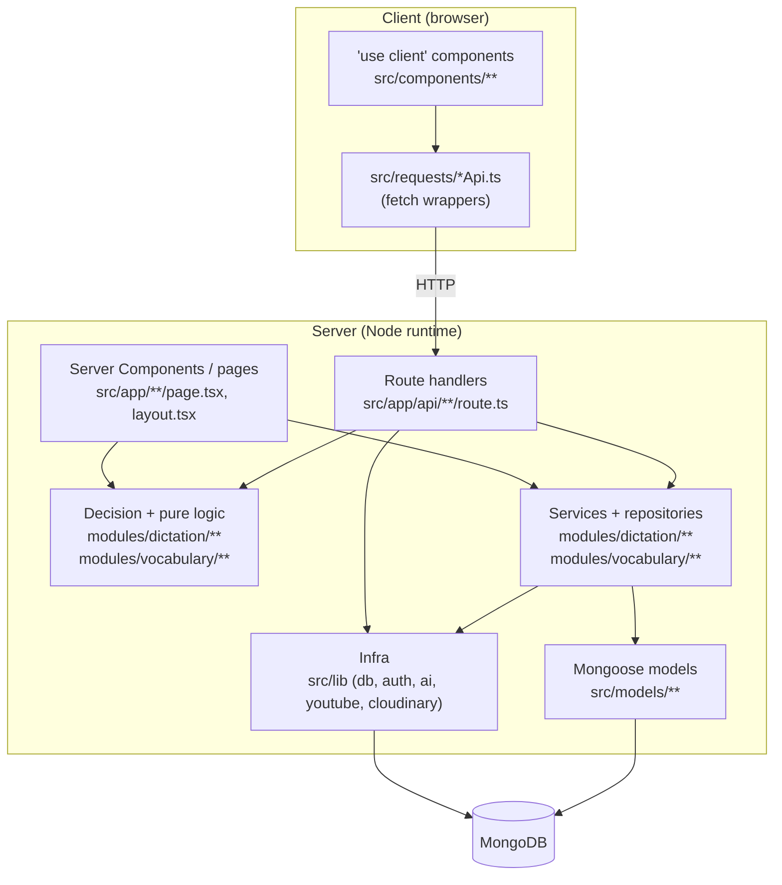
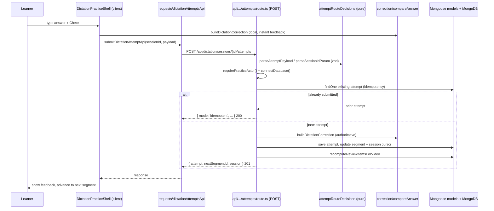
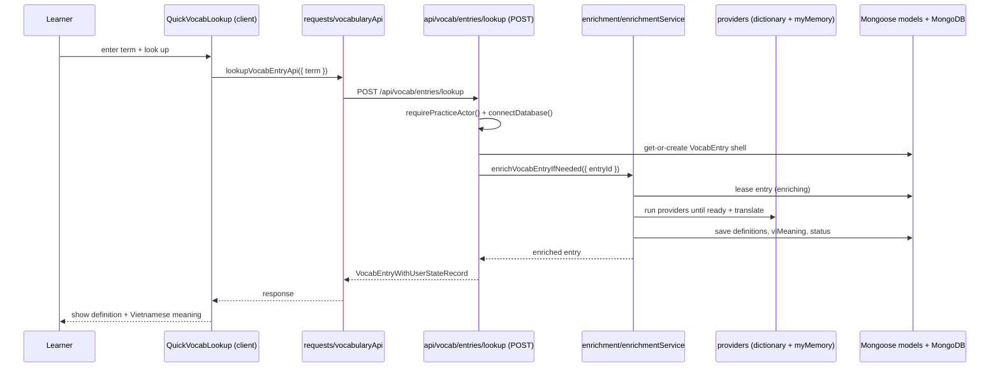

# Architecture: English For Only Me

English For Only Me is a private IELTS study app built on Next.js 16 (App Router),
React 19, Mongoose, and Auth.js v5. Its live modules are the "Dictation Lab",
where a learner transcribes short segments of a YouTube video and gets
token-level correction, review scheduling, and stats, and "Vocabulary", where a
learner searches, classifies, enriches, and recalls words. This document describes how the codebase is
layered so an AI (or engineer) can reason about the system without reading every file.
It is reference-heavy: every claim cites a repo-relative path you can open. Repo root is
`/home/KHOANA/ME/IT_IT/Webs/English_For_Only_Me`; the `@/*` import alias maps to `src/*`
(see `tsconfig.json`).

## 1. Tech stack

The package manager is Bun (`bun.lock` is present; `.agents/rules/testing-quality.md`
and `.agents/rules/project-style.md` both direct contributors to prefer Bun). All
versions below are read from `package.json`.

| Concern             | Choice                                                            | Version                  | Notes                                                                                                                         |
| ------------------- | ----------------------------------------------------------------- | ------------------------ | ----------------------------------------------------------------------------------------------------------------------------- |
| Framework           | `next`                                                            | 16.2.10                  | App Router; middleware renamed to `proxy.ts` (Next 16). See `next.config.ts`.                                                 |
| UI runtime          | `react`, `react-dom`                                              | 19.2.4                   | Server Components by default.                                                                                                 |
| Language            | `typescript`                                                      | ^5                       | `strict: true`, `moduleResolution: "bundler"` (`tsconfig.json`).                                                              |
| Data / ODM          | `mongoose`                                                        | ^9.7.3                   | Models in `src/models`; shared connection in `src/lib/db/connectDatabase.ts`.                                                 |
| Auth                | `next-auth` (Auth.js)                                             | 5.0.0-beta.31            | Google provider; edge-safe config split from Node config.                                                                     |
| Validation          | `zod`                                                             | ^4.4.3                   | Payload/param parsing at API boundaries and in schemas.                                                                       |
| UI primitives       | `@base-ui/react`                                                  | ^1.6.0                   | Underlying primitive layer for the shadcn components.                                                                         |
| Component generator | `shadcn`                                                          | ^4.13.0                  | Config in `components.json` (style `base-nova`, `rsc: true`, lucide icons). Generated primitives live in `src/components/ui`. |
| Styling             | `tailwindcss` + `@tailwindcss/postcss`                            | ^4                       | Tailwind v4 via PostCSS only (`postcss.config.mjs`); no `tailwind.config`. Tokens in `src/app/globals.css`.                   |
| Animations          | `tw-animate-css`                                                  | ^1.4.0                   | Tailwind animation utilities.                                                                                                 |
| Class utilities     | `clsx`, `tailwind-merge`, `class-variance-authority`              | ^2.1.1 / ^3.5.0 / ^0.7.1 | `cn()` helper in `src/lib/utils.ts`; `cva` for variant styling in UI primitives.                                              |
| Icons               | `lucide-react`                                                    | ^1.23.0                  | Standard icon set (`components.json` -> `iconLibrary: "lucide"`).                                                             |
| Server boundary     | `server-only`                                                     | ^0.0.1                   | Imported by server modules to fail the build if pulled client-side.                                                           |
| Testing (unit)      | `vitest`, `@testing-library/*`, `jsdom`                           | ^4.1.9 / ...             | Config in `vitest.config.mts`; jsdom env, globals on.                                                                         |
| Testing (e2e)       | `playwright`                                                      | ^1.61.1                  | Config in `playwright.config.ts`; matches `**/*.e2e.ts` under `src`.                                                          |
| Lint / format       | `eslint` (+ `eslint-config-next`), `prettier` (+ tailwind plugin) | ^9 / ^3.8.1              | `eslint.config.mjs` bans `any` (`@typescript-eslint/no-explicit-any: error`).                                                 |

## 2. Top-level directory map

Every path below is under `src/` unless noted otherwise.

| Directory                   | Purpose (one line)                                                                                                                       |
| --------------------------- | ---------------------------------------------------------------------------------------------------------------------------------------- |
| `src/app`                   | App Router tree: pages, layouts, `loading`/`error`, route handlers under `api/**/route.ts`, plus `layout.tsx`, `page.tsx`, `sitemap.ts`. |
| `src/components`            | Shared React UI, split into `ui` (themed primitives), `common` (cross-feature), and domain folders `dictation`, `home`.                  |
| `src/constants`             | Reusable settings and env wrappers: `environments.ts`, `dictation.ts`, `modules.ts`, `theme.ts`.                                         |
| `src/lib`                   | Framework-agnostic infrastructure: `db`, `auth`, `ai`, `youtube`, `cloudinary`, and `utils.ts` (the `cn` helper).                        |
| `src/models`                | Mongoose schemas and models (`UserModel.ts` plus `dictation/*Model.ts` and `vocabulary/*Model.ts`).                                      |
| `src/modules`               | Business logic for learning domains: dictation (`modules/dictation`) and vocabulary (`modules/vocabulary`).                              |
| `src/requests`              | Client-side fetch wrappers around the internal API; every export ends in `Api`.                                                          |
| `src/types`                 | Ambient/global type declarations (`next-auth.d.ts` augments the session type).                                                           |
| `src/test`                  | Vitest setup and stubs (`setup.ts`, `setupDom.ts`, `serverOnlyStub.ts`, `jsdom.d.ts`).                                                   |
| `scripts` (repo root)       | One-off maintenance scripts run with `tsx` under the `react-server` condition: `backfillContentHierarchy.ts`, `resegmentAllTranscripts.ts`, `seedVocabulary.ts`, `backfillVocabularyVietnameseMeanings.ts` (see section 9).                                    |
| `public` (repo root)        | Static assets: favicons, `site.webmanifest`, icons referenced by `src/app/layout.tsx`.                                                   |
| `.agents/rules` (repo root) | The six rule files defining the intended layering and conventions (style, App Router, API security, data/state, frontend UI, testing).   |

## 3. Layered architecture and dependency direction

The system flows in one direction: UI (pages and client components) sits at the top,
persistence sits at the bottom, and dependencies point downward only. The `.agents/rules`
files codify this: pages stay thin, business logic lives in modules, data access goes
through `connectDatabase()` and models, and client code talks to the server only through
`src/requests` or route handlers (`.agents/rules/project-style.md`,
`.agents/rules/nextjs-app-router.md`, `.agents/rules/data-and-state.md`).

Roles of the three easily-confused layers:

- `src/modules/dictation` is the listening domain layer. It holds pure business logic (no
  framework imports) alongside server services and repositories. Examples:
  - Pure logic (unit-testable, no I/O): `correction/compareAnswer.ts` (token alignment
    and scoring), `correction/normalizeAnswer.ts`, `segmenting/buildSegments.ts`,
    `review/reviewScheduler.ts`, `stats/globalStats.ts`, `stats/videoStats.ts`,
    `content/slugify.ts`, `services/attemptRouteDecisions.ts` (payload parsing plus
    decision helpers extracted so route handlers can be tested without a DB).
  - Services / repositories (server-side, touch models): `services/getCurrentUser.ts`
    (identity resolution), `services/dictationAttemptRecords.ts` (Mongoose doc ->
    API record mappers), `content/contentRepository.ts`, `content/adminContentRepository.ts`,
    `review/reviewItemService.ts`, `stats/globalStatsService.ts`,
    `stats/videoStatsService.ts`, `ai/debriefService.ts`.
  - Schemas: `schemas/*.ts` (zod payload schemas for videos, transcripts, YouTube import).
- `src/modules/vocabulary` is the vocabulary domain layer, a parallel feature area to
  dictation. It mirrors the same pure-decision plus server-service pattern:
  - Pure logic (no I/O): `normalizeVocabTerm.ts`, `recall/recallScheduler.ts`,
    `recall/recallTaskToken.ts`, `stats/vocabStats.ts`, `vietnameseMeaning.ts` (Vietnamese
    meaning helpers and the missing-meaning filter), `services/vocabularyRouteDecisions.ts`,
    and shared `constants.ts` / `types.ts`.
  - Server services (touch models): `services/vocabEntryService.ts`,
    `services/userVocabItemService.ts`, `services/vocabWordListService.ts`,
    `explore/exploreService.ts`, `stats/vocabStatsService.ts`,
    `recall/recallTaskService.ts`, `recall/recallAnswerService.ts`, and
    `enrichment/enrichmentService.ts` (leases an entry via `VOCAB_ENRICHMENT_LEASE_MS`,
    runs the providers in order, writes definitions plus the Vietnamese meaning, and sets
    the entry `enrichmentStatus`). Doc -> API record mappers live in
    `services/vocabEntryRecords.ts`, `services/userVocabItemRecords.ts`, and
    `services/vocabOccurrenceRecords.ts`.
  - Providers (`providers/`): `dictionaryApiDev.ts` and `freeDictionaryApi.ts` normalize
    free dictionary responses behind one typed adapter contract (`types.ts`,
    `providerUtils.ts`, `index.ts`); `myMemoryTranslate.ts` supplies Vietnamese
    translations.
  - Seed: `seed/seedVocabulary.ts` downloads the official NGSL stats CSV
    (`NGSL_STATS_CSV_URL`) and upserts the top 1000 word shells (`parseNgslStatsCsv`).
- `src/lib` is framework-agnostic infrastructure shared across modules: the Mongoose
  connection cache (`db/connectDatabase.ts`), Auth.js setup (`auth/auth.ts`,
  `auth/auth.config.ts`, `auth/roles.ts`, `auth/guestUser.ts`), the OpenAI client
  (`ai/openAiClient.ts`, `ai/openAiClientCore.ts`), YouTube helpers
  (`youtube/extractYouTubeId.ts`, `youtube/getYouTubeVideoMetadata.ts`), Cloudinary
  upload (`cloudinary/uploadImage.ts`), and `utils.ts`. Server-only lib modules start
  with `import 'server-only'` (see `db/connectDatabase.ts`, `services/getCurrentUser.ts`).
- `src/requests` is the client-side fetch layer. Each file wraps one internal API
  family with `fetch`, sets `cache: 'no-store'`, and rethrows the API's `{ message }` on
  failure. Dictation wrappers: `dictationAttemptsApi.ts`, `dictationSessionsApi.ts`,
  `dictationStatsApi.ts`, `dictationVideosApi.ts`, `dictationTranscriptsApi.ts`,
  `dictationImportsApi.ts`, `dictationDebriefsApi.ts`. Vocabulary wrappers live in a
  single `vocabularyApi.ts` (`lookupVocabEntryApi`, `searchVocabApi`, `getExploreVocabApi`,
  `setVocabItemStatusApi`, `getDueVocabRecallApi`, `answerVocabRecallApi`,
  `getVocabStatsApi`, plus the admin `getVocabAdminQueueApi` / `enrichVocabularyAdminApi`).
  Client components import these; they never import server-only modules directly.



Dependency rule: arrows only point downward/rightward toward persistence. Client
components reach the server exclusively through `src/requests` (HTTP) or, for reads, via
props hydrated by a Server Component. `src/lib` and `src/models` never import from
`src/app` or `src/components`.

## 4. Server vs client component boundaries

- Server Components are the default. Every `page.tsx` and `layout.tsx` under `src/app`
  is a Server Component unless it opts out. Pages fetch data by calling module services
  directly (e.g. `src/app/page.tsx` imports `getGlobalStatsForUser` and
  `getOptionalUser`), then pass plain data down as props.
- `'use client'` is added only to files that use hooks, event handlers, browser APIs, or
  local state, per `.agents/rules/nextjs-app-router.md`. The dictation practice UI is the
  main client island: `src/components/dictation/DictationPracticeShell.tsx` begins with
  `'use client'` and owns typing state, keyboard shortcuts, the YouTube player hook
  (`modules/dictation/player/useYoutubeDictationPlayer.ts`), and local answer drafts.
- Secret isolation: server-only infra imports `server-only` so any accidental client
  import fails the build (`src/lib/db/connectDatabase.ts`, `src/modules/dictation/services/getCurrentUser.ts`).
  Env access is centralized in `src/constants/environments.ts`; all secret getters read
  `process.env` server-side and there are no `NEXT_PUBLIC_*` secrets
  (`.agents/rules/api-security.md`). Correction logic is duplicated safely on both sides:
  the same pure function `buildDictationCorrection` (`modules/dictation/correction/compareAnswer.ts`)
  runs in the browser for instant feedback and on the server for the authoritative
  record; it contains no secrets or I/O.
- Runtime and dynamic flags: data pages force the Node runtime and disable static
  caching so per-user and freshly-created content is never frozen. `src/app/page.tsx`,
  `src/app/sitemap.ts`, and `src/app/admin/layout.tsx` all export
  `export const dynamic = 'force-dynamic'` and `export const runtime = 'nodejs'`. Route
  handlers likewise set `export const runtime = 'nodejs'` (e.g.
  `src/app/api/dictation/sessions/[sessionId]/attempts/route.ts`) because Mongoose is not
  edge-compatible.

## 5. Request / data-flow walkthroughs

The two live subsystems share the same shape: a client component calls a `src/requests`
wrapper, which hits a route handler that parses input with pure decision helpers, resolves
the actor, connects to Mongo, delegates to module services, and returns safe records.
Below are one dictation flow and one vocabulary flow.

### 5.1 Dictation practice attempt

Scenario: the learner types an answer for the current segment and presses check. The app
shows local feedback immediately, then persists the attempt and advances the session.

Files involved, in order:

1. `src/components/dictation/DictationPracticeShell.tsx` (`'use client'`): computes local
   feedback with `buildDictationCorrection` / `createLocalDictationAttempt` from
   `@/modules/dictation/correction`, then calls the request wrapper.
2. `src/requests/dictationAttemptsApi.ts`: `submitDictationAttemptApi(sessionId, payload)`
   does `fetch` `POST /api/dictation/sessions/{sessionId}/attempts` with
   `cache: 'no-store'`, rethrowing the API `message` on failure.
3. `src/app/api/dictation/sessions/[sessionId]/attempts/route.ts` (the `POST` handler):
   the orchestration layer. It (a) guards missing MongoDB, (b) parses the `sessionId`
   param via `parseSessionIdParam` (`services/sessionRouteDecisions.ts`), (c) parses the
   body with `parseAttemptPayload` (`services/attemptRouteDecisions.ts`, zod), (d)
   resolves the actor with `requirePracticeActor()` (`services/getCurrentUser.ts`), and
   (e) connects with `connectDatabase()`.
4. Idempotency: it looks up an existing `DictationAttemptModel` by
   `{ userId, sessionId, idempotencyKey }`; `resolveAttemptSubmissionMode`
   (`services/attemptRouteDecisions.ts`) returns the prior attempt with
   `mode: 'idempotent'` on replay instead of double-writing.
5. Correction: it loads the segment (`DictationSegmentModel`), calls the authoritative
   `buildDictationCorrection` (`modules/dictation/correction/compareAnswer.ts`), and
   builds a `DictationAttemptModel` with normalized tokens, `isPassed`, `feedbackTokens`,
   and `stats`.
6. Session cursor: `shouldAdvanceAttemptCursor` and `getCheckSegmentStatus`
   (`services/attemptRouteDecisions.ts`) decide whether to advance. On a pass/skip it
   moves `session.currentSegmentId` to the next segment by `order`, or marks the session
   `completed` and increments `DictationVideoModel.completedSessionCount`.
7. Review scheduling: `recomputeReviewItemsForVideo` (`modules/dictation/review/reviewItemService.ts`)
   updates the spaced-review queue for that user and video.
8. Response mapping: `toDictationAttemptRecord` and `toDictationSessionRecord`
   (`services/dictationAttemptRecords.ts`, `services/dictationSessionRecords.ts`) convert
   Mongoose docs to safe API records; the handler returns
   `{ attempt, mode, nextSegmentId, session }` with status 201 (or 200 on idempotent
   replay).
9. Back in the client shell, the response advances the UI to `nextSegmentId`. Stats
   pages (`src/app/(app)/dictation/stats/page.tsx`) later read aggregates through
   `src/requests/dictationStatsApi.ts` -> `src/app/api/dictation/stats/route.ts` ->
   `modules/dictation/stats/globalStatsService.ts`.



### 5.2 Vocabulary lookup and enrichment

Scenario: the learner looks up a word in the vocabulary UI. The shell (or dictionary
shell) creates a shell entry on demand, then enriches it from dictionary and translation
providers before returning definitions and the Vietnamese meaning.

Files involved, in order:

1. `src/components/vocabulary/QuickVocabLookup.tsx` (`'use client'`): reads the term and
   calls the request wrapper, then renders `getEnglishDefinition` /
   `getRequiredVietnameseMeaning` from `@/modules/vocabulary/vietnameseMeaning`.
2. `src/requests/vocabularyApi.ts`: `lookupVocabEntryApi({ term, ... })` does `fetch`
   `POST /api/vocab/entries/lookup` with `cache: 'no-store'`, rethrowing the API `message`.
3. `src/app/api/vocab/entries/lookup/route.ts` (`runtime = 'nodejs'`): guards missing
   Mongo, resolves the actor with `requirePracticeActor()`
   (`modules/dictation/services/getCurrentUser.ts`, shared across both subsystems), calls
   `connectDatabase()`, gets-or-creates the entry shell, then calls
   `enrichVocabEntryIfNeeded({ entryId })`.
4. `src/modules/vocabulary/enrichment/enrichmentService.ts`: leases the entry
   (`VOCAB_ENRICHMENT_LEASE_MS`), runs the default providers in order until one returns
   `status: 'ready'` (`providers/dictionaryApiDev.ts`, `providers/freeDictionaryApi.ts`),
   fetches the Vietnamese meaning via `providers/myMemoryTranslate.ts`, persists
   definitions plus `rawProviderData`, and sets `enrichmentStatus` to `ready`, `failed`,
   or `notFound`.
5. Response mapping: `services/vocabEntryRecords.ts` converts the Mongoose doc plus the
   per-user state into a `VocabEntryWithUserStateRecord` returned to the client.



## 6. Auth and proxy edge protection

`src/proxy.ts` is the Next 16 middleware (renamed convention). It builds `auth` from the
edge-safe `authConfig` (`src/lib/auth/auth.config.ts`, which imports only env helpers and
role logic - no Mongoose) and exports `config.matcher = ['/admin/:path*']`, so the proxy
runs only on admin routes. Its `authorized` callback returns `true` for everything except
`/admin`, and for `/admin` requires `auth?.user?.role === 'admin'`.

Defense in depth: the edge guard is not the only check. `src/app/admin/layout.tsx`
re-verifies server-side with `getOptionalUser()` and redirects anonymous users to sign in
and non-admins to `/dictation`. Admin route handlers and services re-check as well, and
per-user (non-admin) APIs enforce their own identity via `requireUser` /
`requirePracticeActor` in `src/modules/dictation/services/getCurrentUser.ts` rather than
relying on the proxy. Deeper auth details (session shaping, guest merge, provisioning)
belong in the dedicated auth doc; `src/types/next-auth.d.ts` augments the session `user`
with `id` and `role`.

## 7. Route group structure

```
src/app/
  layout.tsx            Root layout (server): metadata, fonts, <html>/<body>
  page.tsx              Home study desk (server, force-dynamic)
  sitemap.ts            Dynamic sitemap
  globals.css           Tailwind v4 tokens + theme
  (app)/                Route GROUP - learner-facing, no URL segment
    dictation/
      page.tsx          Catalog / library
      loading.tsx, error.tsx, no-topic/
      favorites/, review/, stats/
      [topicSlug]/                          Topic browse
      videos/[videoId]/practice/            Practice screen (hosts the client shell)
      videos/[videoId]/results/             Results summary
    vocabulary/
      page.tsx, words/                       Dashboard and filtered word lists
  admin/                Admin section (protected by proxy + layout re-check)
    layout.tsx, page.tsx, import/, topics/, videos/, videos/[videoId]/edit/, vocab/
  api/                  Route handlers (all POST/GET etc. under **/route.ts)
    auth/[...nextauth]/route.ts             Auth.js handler
    dictation/
      sessions/, sessions/[sessionId]/, sessions/[sessionId]/attempts/
      segments/[segmentId]/, transcripts/, transcripts/[transcriptId]/...
      videos/, videos/[videoId]/, stats/, review-items/, debriefs/, imports/youtube/
    vocab/
      entries/lookup/, search/, explore/, items/, recall/due/, recall/answer/, stats/
    admin/vocab/enrich/
```

The `(app)` group applies shared learner layout without adding an `/app` URL segment;
`admin` and `api` are real path segments. Details for each page and endpoint live in the
frontend and API docs.

## 8. Graceful-degradation design

The app is designed to boot and serve public pages even when MongoDB, OpenAI, YouTube, or
Cloudinary credentials are absent. The mechanism is centralized in
`src/constants/environments.ts`, which exposes typed getters and boolean probes:

- `hasMongoDbUri()` returns whether `MONGODB_URI` is set. `src/app/page.tsx` guards on it:
  `if (!hasMongoDbUri()) return <HomeStudyDesk />` - the home page renders without any DB
  call, and only then does it fetch per-user stats. `src/app/sitemap.ts` does the same,
  returning static entries when the DB is unconfigured.
- Route handlers short-circuit when Mongo is missing (e.g. `getMissingMongoResponse()` in
  the attempts handler `src/app/api/dictation/sessions/[sessionId]/attempts/route.ts`).
- Optional-service getters return `null` instead of throwing: `getYoutubeApiKey()`,
  `getOpenAiApiKey()` use `getOptionalServerEnv`, while required-for-that-feature secrets
  use `getRequiredServerEnv` (which throws `MissingEnvironmentError`, caught and mapped to
  a clean 500 in handlers). `getOpenAiDebriefModel()` and `getIeltsGoal()` fall back to
  sensible defaults; `hasGoogleAuth()` gates OAuth; `getSiteUrl()` falls back to
  `AUTH_URL` then `http://localhost:3000`.

Net effect: no key is required just to run the app locally; features light up as their
env vars are provided.

## 9. Build, run, and test commands

From `package.json` scripts (run with Bun per project convention, e.g. `bun run dev`):

| Command                    | Action                                                                                                                                             |
| -------------------------- | -------------------------------------------------------------------------------------------------------------------------------------------------- |
| `bun run dev`              | `next dev` - local development server.                                                                                                             |
| `bun run build`            | `next build` - production build (exercises App Router / metadata).                                                                                 |
| `bun run start`            | `next start` - serve the production build.                                                                                                         |
| `bun run lint`             | `eslint` - lint (bans `any`, warns on stray `console`).                                                                                            |
| `bun run lint:fix`         | `eslint . --fix`.                                                                                                                                  |
| `bun run test`             | `vitest run` - single-pass unit tests (jsdom).                                                                                                     |
| `bun run test:watch`       | `vitest` - watch mode.                                                                                                                             |
| `bun run format`           | `prettier . --write`.                                                                                                                              |
| `bun run format:check`     | `prettier . --check`.                                                                                                                              |
| `bun run backfill:content` | `node --conditions=react-server --import tsx scripts/backfillContentHierarchy.ts` - one-off content-hierarchy migration.                           |
| `bun run resegment`        | `node --conditions=react-server --env-file-if-exists=.env --import tsx scripts/resegmentAllTranscripts.ts` - re-segments every dictation transcript with the current pause logic; DRY RUN unless `-- --apply` is passed (destructive with `--apply`). |
| `bun run vocab:seed`       | `node --conditions=react-server --env-file-if-exists=.env.development --import tsx scripts/seedVocabulary.ts` - downloads the NGSL stats CSV and upserts the top 1000 vocabulary shells. |
| `bun run vocab:backfill-vi`| `node --conditions=react-server --env-file-if-exists=.env --import tsx scripts/backfillVocabularyVietnameseMeanings.ts` - backfills Vietnamese meanings for entries missing them (batch limit via arg or `VOCAB_VI_BACKFILL_LIMIT`; `--overwrite` to replace existing). |
| `bun run clean`            | `rm -rf .next node_modules bun.lock` - destructive; do not run unless asked.                                                                       |

End-to-end tests use Playwright (`playwright.config.ts`, matching `**/*.e2e.ts` under
`src`) and are run via the Playwright CLI rather than a package script.
