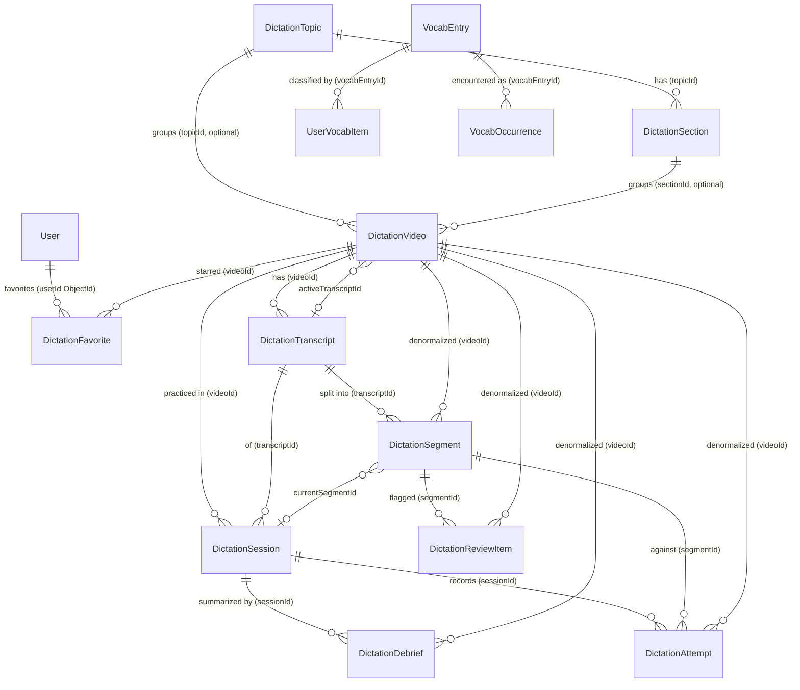

# Data Model Reference

This document is the persistence-layer reference for "English For Only Me", a dictation-based IELTS English practice app built on Next.js and Mongoose (MongoDB). It describes the connection pattern, every Mongoose model in `src/models/`, their fields, indexes, enums, derived counters, ownership rules, and idempotency guarantees, so an AI can reason about the data layer without opening every schema file. Every claim is grounded in real source and cites a repo-relative path.

## 1. Database Overview

The app talks to MongoDB through Mongoose. There is no Auth.js database adapter; the whole app shares one ODM and one MongoDB driver, and even users are managed as a plain Mongoose model (see the header comment in `src/models/UserModel.ts`, which explains that an adapter would peer-require `mongodb ^6` while the project ships `mongodb 7` via `mongoose 9`).

### 1.1 Cached-connection pattern

Connection setup lives in `src/lib/db/connectDatabase.ts`. It is a `server-only` module that caches a single `Mongoose` connection (and its in-flight promise) on `globalThis` so hot-reload and serverless invocations reuse one connection instead of opening a new one per request:

- A `MongooseCache` object `{ connection, promise }` is stashed on `globalThis.mongooseCache` (`connectDatabase.ts:12-21`).
- `connectDatabase()` returns the cached `connection` immediately if present (`connectDatabase.ts:24`).
- Otherwise it starts (once) `mongoose.connect(getMongoDbUri(), { bufferCommands: false })` and caches the promise (`connectDatabase.ts:26-29`). `bufferCommands: false` means queries issued before the connection is ready reject rather than buffer.
- On success the resolved connection is cached and returned; on failure the promise is reset to `null` so the next call retries (`connectDatabase.ts:31-37`).

The Mongo URI comes from `getMongoDbUri()` in `@/constants/environments`. Callers `await connectDatabase()` before running queries (for example `src/modules/dictation/services/mergeGuestData.ts:28`).

### 1.2 Model registration guard

Every model file is `server-only` and uses the same recompilation guard so Next.js hot reload does not re-register a model and throw `OverwriteModelError`:

```ts
export const XModel =
  (models.X as Model<XDocument> | undefined) ?? model<XDocument>('X', XSchema)
```

That is, reuse `mongoose.models.X` if it already exists, otherwise compile it. Examples: `src/models/UserModel.ts:55-57`, `src/models/dictation/DictationVideoModel.ts:203-205`, `src/models/dictation/DictationFavoriteModel.ts:42-44`. Document types are derived with `InferSchemaType<typeof XSchema>` rather than hand-written interfaces.

Registered model names (the string passed to `model(...)`):

| Model name            | File                                               | Ownership                 |
| --------------------- | -------------------------------------------------- | ------------------------- |
| `User`                | `src/models/UserModel.ts`                          | identity                  |
| `DictationTopic`      | `src/models/dictation/DictationTopicModel.ts`      | global content            |
| `DictationSection`    | `src/models/dictation/DictationSectionModel.ts`    | global content            |
| `DictationVideo`      | `src/models/dictation/DictationVideoModel.ts`      | global content            |
| `DictationTranscript` | `src/models/dictation/DictationTranscriptModel.ts` | global content            |
| `DictationSegment`    | `src/models/dictation/DictationSegmentModel.ts`    | global content*           |
| `DictationSession`    | `src/models/dictation/DictationSessionModel.ts`    | per-user                  |
| `DictationAttempt`    | `src/models/dictation/DictationAttemptModel.ts`    | per-user                  |
| `DictationReviewItem` | `src/models/dictation/DictationReviewItemModel.ts` | per-user                  |
| `DictationDebrief`    | `src/models/dictation/DictationDebriefModel.ts`    | per-user                  |
| `DictationFavorite`   | `src/models/dictation/DictationFavoriteModel.ts`   | per-user                  |
| `VocabEntry`          | `src/models/vocabulary/VocabEntryModel.ts`         | global dictionary cache   |
| `UserVocabItem`       | `src/models/vocabulary/UserVocabItemModel.ts`      | per-user vocabulary state |
| `VocabOccurrence`     | `src/models/vocabulary/VocabOccurrenceModel.ts`    | per-user vocabulary trail |

*`DictationSegment` is global content, but it carries per-segment aggregate progress fields (`attemptStatus`, `attemptCount`, `lastAttemptAt`) that are not user-scoped (see section 6).

## 2. Entity-Relationship Overview

Content hierarchy is `Topic -> Section -> Video -> Transcript -> Segment`. Per-user practice data (`Session`, `Attempt`, `ReviewItem`, `Debrief`, `Favorite`) hangs off `Video`/`Segment`/`Transcript`/`Session`. Note that most references are stored as raw `ObjectId` fields with `ref:` hints, not populated relations; and the per-user `userId` is a `String` on Session/Attempt/ReviewItem/Debrief (it can hold a guest id) but an `ObjectId` on Favorite.



## 3. Models

Every model uses Mongoose `{ timestamps: true }` (adding `createdAt`/`updatedAt`) unless noted. `required`/`default` columns below reflect the schema definitions exactly.

### 3.1 User (`src/models/UserModel.ts`)

Purpose: app user, provisioned on first Google sign-in (Auth.js v5, JWT sessions). Persists only durable identity plus a login timestamp. Importantly, `role` is NOT stored here; it is derived from `ADMIN_EMAILS` at token time (see the class comment `UserModel.ts:11-19` and `src/types/next-auth.d.ts`, where `role: UserRole` lives on the session/JWT, not the DB).

| Field         | Type   | Required / Default      | Meaning                              |
| ------------- | ------ | ----------------------- | ------------------------------------ |
| `email`       | String | required, unique        | Login email; `trim`, `lowercase`.    |
| `googleSub`   | String | default `null`, indexed | Google subject id (stable OAuth id). |
| `name`        | String | default `null`          | Display name; `trim`.                |
| `image`       | String | default `null`          | Avatar URL.                          |
| `lastLoginAt` | Date   | default `null`          | Last successful login time.          |

- Indexes: unique index on `email` (via field `unique: true`); single-field index on `googleSub`.
- Timestamps: yes.
- Enums / hooks: none.
- Note: `User._id` (ObjectId) is the identity that `DictationFavorite.userId` references. The `String` `userId` on Session/Attempt/ReviewItem/Debrief stores the stringified user ObjectId or a guest id.

### 3.2 DictationTopic (`src/models/dictation/DictationTopicModel.ts`)

Purpose: top of the shared content hierarchy (`Topic > Section > Video`). Global, admin-curated content. Level range, section count, and lesson count are derived by aggregation, not stored (see comment `DictationTopicModel.ts:11-15` and `DictationTopicSummaryRecord` in `src/modules/dictation/types.ts:124-129`).

| Field           | Type    | Required / Default             | Meaning                                                          |
| --------------- | ------- | ------------------------------ | ---------------------------------------------------------------- |
| `slug`          | String  | required, unique               | URL slug; `trim`, `lowercase`, `maxlength 120`.                  |
| `title`         | String  | required                       | Display title; `trim`, `maxlength 160`.                          |
| `description`   | String  | default `null`                 | Optional description; `trim`, `maxlength 2000`.                  |
| `thumbnailUrl`  | String  | default `null`                 | Optional thumbnail; `trim`.                                      |
| `hasVideoMedia` | Boolean | required, default `false`      | Whether the topic itself carries video media (vs pure grouping). |
| `order`         | Number  | required, default `0`, indexed | Manual sort order in the browse grid.                            |

- Indexes: unique on `slug`; single-field index on `order`.
- Timestamps: yes. Enums / hooks: none.

### 3.3 DictationSection (`src/models/dictation/DictationSectionModel.ts`)

Purpose: middle of the content hierarchy; always belongs to a Topic. Videos reference a section optionally; a topic video with no section falls back to an "Ungrouped" bucket at render time (comment `DictationSectionModel.ts:11-15`).

| Field     | Type                            | Required / Default    | Meaning                                 |
| --------- | ------------------------------- | --------------------- | --------------------------------------- |
| `topicId` | ObjectId (`ref DictationTopic`) | required, indexed     | Parent topic.                           |
| `title`   | String                          | required              | Section title; `trim`, `maxlength 160`. |
| `order`   | Number                          | required, default `0` | Sort order within the topic.            |

- Indexes: single-field index on `topicId`; compound `{ topicId: 1, order: 1 }` (`DictationSectionModel.ts:41`).
- Timestamps: yes. Enums / hooks: none.

### 3.4 DictationVideo (`src/models/dictation/DictationVideoModel.ts`)

Purpose: a practicable lesson (currently always a YouTube source). Carries content-placement fields (`topicId`, `sectionId`, `level`, `order`), lifecycle status, import metadata, a pointer to the active transcript, and denormalized counters. All hierarchy fields are optional: a video may sit in no topic and/or no section (comment `DictationVideoModel.ts:148-149`).

| Field                   | Type                                          | Required / Default                             | Meaning                                                        |
| ----------------------- | --------------------------------------------- | ---------------------------------------------- | -------------------------------------------------------------- |
| `sourceType`            | String enum `['youtube']`                     | required, default `'youtube'`                  | Source kind (only YouTube today).                              |
| `title`                 | String                                        | required                                       | Video title; `trim`, `maxlength 240`.                          |
| `youtubeUrl`            | String                                        | required, unique                               | Canonical YouTube URL; `trim`, `maxlength 2048`.               |
| `sourceUrl`             | String                                        | default `null`                                 | Original submitted URL; `trim`, `maxlength 2048`.              |
| `youtubeVideoId`        | String                                        | default `null`, indexed                        | Parsed 11-char video id; unique when a string (partial index). |
| `channelTitle`          | String                                        | default `null`                                 | YouTube channel name; `trim`.                                  |
| `thumbnailUrl`          | String                                        | default `null`                                 | Thumbnail URL; `trim`.                                         |
| `durationSeconds`       | Number                                        | default `null`, `min 0`                        | Video length in seconds.                                       |
| `defaultLanguage`       | String                                        | required, default `'en'`                       | Default caption language; `trim`.                              |
| `purpose`               | String enum                                   | required, default `'ielts-listening'`          | One of `ielts-listening`, `general-listening`, `shadowing`.    |
| `status`                | String enum (9 values)                        | required, default `'needsTranscript'`, indexed | Lifecycle; see section 4.1 (`DictationVideoStatus`).           |
| `transcriptStatus`      | String enum                                   | required, default `'manualNeeded'`             | `none` / `manualNeeded` / `manualAdded`; see 4.2.              |
| `importStatus`          | String enum (5 values)                        | required, default `'draft'`                    | Metadata-import lifecycle; see 4.3.                            |
| `importWarning`         | String                                        | default `null`                                 | Human-readable import caveat; `trim`.                          |
| `activeTranscriptId`    | ObjectId (`ref DictationTranscript`)          | default `null`                                 | The transcript currently used for practice.                    |
| `sentenceCount`         | Number                                        | required, default `0`, `min 0`                 | Denormalized count of active-transcript segments (see 5).      |
| `completedSessionCount` | Number                                        | required, default `0`, `min 0`                 | Denormalized count of completed sessions (see 5).              |
| `lastPracticedAt`       | Date                                          | default `null`                                 | Last time any user completed a session.                        |
| `tags`                  | [String]                                      | default `[]`                                   | Free-form tags.                                                |
| `collections`           | [String]                                      | default `[]`                                   | Named collection membership.                                   |
| `topicId`               | ObjectId (`ref DictationTopic`)               | default `null`, indexed                        | Optional parent topic.                                         |
| `sectionId`             | ObjectId (`ref DictationSection`)             | default `null`, indexed                        | Optional parent section.                                       |
| `level`                 | String enum `['A1','A2','B1','B2','C1','C2']` | default `null`, indexed                        | Per-video CEFR level (`DictationLevel`).                       |
| `order`                 | Number                                        | required, default `0`, indexed                 | Manual sort order within section/topic.                        |

- Indexes (field-level `index: true`): `youtubeVideoId`, `status`, `topicId`, `sectionId`, `level`, `order`. Additional `schema.index(...)` (`DictationVideoModel.ts:180-194`):
  - `{ createdAt: -1 }`
  - `{ topicId: 1, sectionId: 1 }`
  - `{ order: 1, createdAt: -1 }`
  - `{ youtubeUrl: 1 }` unique
  - `{ youtubeVideoId: 1 }` unique with `partialFilterExpression: { youtubeVideoId: { $type: 'string' } }` (so multiple `null` ids do not collide).
- Timestamps: yes. Enums: see section 4. Hooks / virtuals: none.

### 3.5 DictationTranscript (`src/models/dictation/DictationTranscriptModel.ts`)

Purpose: a source transcript for a video. Stores raw text and optional timed cues (embedded subdocuments), a source hash for dedup, and quality metadata. Multiple transcripts may exist per video; one is `isActive`.

Embedded `DictationCueSchema` (`_id: false`, `DictationTranscriptModel.ts:13-40`):

| Field     | Type   | Required / Default      | Meaning                             |
| --------- | ------ | ----------------------- | ----------------------------------- |
| `index`   | Number | required, `min 0`       | Cue ordinal.                        |
| `text`    | String | required                | Cue text; `trim`, `maxlength 5000`. |
| `startMs` | Number | default `null`, `min 0` | Cue start (ms); null when untimed.  |
| `endMs`   | Number | default `null`, `min 0` | Cue end (ms); null when untimed.    |

`DictationTranscriptSchema`:

| Field           | Type                                        | Required / Default                | Meaning                                                                                                          |
| --------------- | ------------------------------------------- | --------------------------------- | ---------------------------------------------------------------------------------------------------------------- |
| `videoId`       | ObjectId (`ref DictationVideo`)             | required, indexed                 | Parent video.                                                                                                    |
| `sourceType`    | String enum                                 | required                          | `manualText` / `manualTimedText` / `captionFile` / `youtubeOwnedCaption`; see 4.x below.                         |
| `language`      | String                                      | required, default `'en'`          | Transcript language; `trim`.                                                                                     |
| `isActive`      | Boolean                                     | required, default `true`, indexed | Whether this is the active transcript.                                                                           |
| `rawText`       | String                                      | required, `maxlength 500000`      | Full raw transcript text.                                                                                        |
| `rawCues`       | [DictationCueSchema]                        | default `[]`                      | Timed cue list (may be empty for untimed).                                                                       |
| `sourceHash`    | String                                      | required, indexed                 | Content hash used for dedup; `trim`.                                                                             |
| `qualityStatus` | String enum `['blocked','warning','ready']` | required                          | Quality gate; see 4.x.                                                                                           |
| `qualityFlags`  | [String]                                    | default `[]`                      | Quality flags (`DictationTranscriptQualityFlag`, see 4.9); note the array is not enum-constrained in the schema. |
| `cueCount`      | Number                                      | required, default `0`, `min 0`    | Number of cues (denormalized).                                                                                   |
| `segmentCount`  | Number                                      | required, default `0`, `min 0`    | Number of segments produced (denormalized, see 5).                                                               |
| `createdBy`     | String enum `['manual','import','system']`  | required, default `'manual'`      | Provenance.                                                                                                      |

- Indexes: field-level on `videoId`, `isActive`, `sourceHash`. Compound (`DictationTranscriptModel.ts:120-124`): `{ videoId: 1, isActive: 1 }` and `{ videoId: 1, sourceHash: 1 }` unique (dedup guarantee: one transcript per video per source hash).
- Timestamps: yes. Hooks / virtuals: none.

### 3.6 DictationSegment (`src/models/dictation/DictationSegmentModel.ts`)

Purpose: one dictation sentence/line derived from a transcript. This is the unit the learner types. It stores both display `text` and `normalizedText`, optional timing, source cue indices, quality flags, and per-segment aggregate progress.

| Field                  | Type                                 | Required / Default                        | Meaning                                            |
| ---------------------- | ------------------------------------ | ----------------------------------------- | -------------------------------------------------- |
| `videoId`              | ObjectId (`ref DictationVideo`)      | required, indexed                         | Parent video (denormalized from transcript).       |
| `transcriptId`         | ObjectId (`ref DictationTranscript`) | required, indexed                         | Source transcript.                                 |
| `transcriptSourceHash` | String                               | required, indexed                         | Source hash of the originating transcript; `trim`. |
| `order`                | Number                               | required, `min 0`, indexed                | Segment ordinal within the transcript.             |
| `text`                 | String                               | required, `maxlength 3000`                | Display text; `trim`.                              |
| `normalizedText`       | String                               | required, `maxlength 3000`                | Normalized comparison text; `trim`.                |
| `startMs`              | Number                               | default `null`, `min 0`                   | Segment start (ms).                                |
| `endMs`                | Number                               | default `null`, `min 0`                   | Segment end (ms).                                  |
| `cueIndexes`           | [Number]                             | default `[]`                              | Indices of source cues folded into this segment.   |
| `qualityFlags`         | [String] enum `segmentQualityFlags`  | default `[]`                              | See 4.10 (`DictationSegmentQualityFlag`).          |
| `warningAccepted`      | Boolean                              | required, default `false`                 | Admin accepted a quality warning for this segment. |
| `attemptStatus`        | String enum (5 values)               | required, default `'notStarted'`, indexed | Aggregate attempt state; see 4.4.                  |
| `attemptCount`         | Number                               | required, default `0`, `min 0`            | Aggregate attempt count.                           |
| `lastAttemptAt`        | Date                                 | default `null`                            | Last attempt time.                                 |

- Indexes: field-level on `videoId`, `transcriptId`, `transcriptSourceHash`, `order`, `attemptStatus`. Compound (`DictationSegmentModel.ts:116-117`): `{ transcriptId: 1, order: 1 }` and `{ videoId: 1, order: 1 }`.
- Timestamps: yes. Hooks / virtuals: none.
- Caveat: `attemptStatus`/`attemptCount`/`lastAttemptAt` are global on the segment, not per-user (see section 6).

### 3.7 DictationSession (`src/models/dictation/DictationSessionModel.ts`)

Purpose: a per-user practice run over one video/transcript. Tracks the current position and playback preferences. `userId` is a `String` (holds a real user's stringified ObjectId or a `guest_...` id).

| Field                 | Type                                             | Required / Default                         | Meaning                                  |
| --------------------- | ------------------------------------------------ | ------------------------------------------ | ---------------------------------------- |
| `userId`              | String                                           | required, indexed                          | Owner (user id or guest id); `trim`.     |
| `videoId`             | ObjectId (`ref DictationVideo`)                  | required, indexed                          | Video being practiced.                   |
| `transcriptId`        | ObjectId (`ref DictationTranscript`)             | required, indexed                          | Transcript in use.                       |
| `status`              | String enum `['active','completed','abandoned']` | required, default `'active'`, indexed      | Session lifecycle; see 4.5.              |
| `currentSegmentId`    | ObjectId (`ref DictationSegment`)                | default `null`                             | Cursor: current segment.                 |
| `currentSegmentOrder` | Number                                           | required, default `0`, `min 0`             | Cursor: current segment order.           |
| `playbackSpeed`       | Number                                           | required, default `1`, `min 0.25`, `max 2` | Player speed preference.                 |
| `showShortcuts`       | Boolean                                          | required, default `true`                   | UI preference.                           |
| `isVideoHidden`       | Boolean                                          | required, default `false`                  | UI preference (hide video, audio-only).  |
| `startedAt`           | Date                                             | required, default `Date.now`               | Session start.                           |
| `lastActiveAt`        | Date                                             | required, default `Date.now`, indexed      | Last activity; used for resume ordering. |
| `completedAt`         | Date                                             | default `null`                             | Completion time.                         |

- Indexes: field-level on `userId`, `videoId`, `transcriptId`, `status`, `lastActiveAt`. Compound (`DictationSessionModel.ts:89-90`): `{ userId: 1, videoId: 1, status: 1 }` and `{ userId: 1, lastActiveAt: -1 }`.
- Timestamps: yes. Hooks / virtuals: none.

### 3.8 DictationAttempt (`src/models/dictation/DictationAttemptModel.ts`)

Purpose: an append-only record of one submission (check/reveal/skip) against a segment inside a session. Stores the typed answer, a snapshot of the expected text, correction tokens, and computed stats. This is the source of truth for all learner analytics.

Embedded `DictationCorrectionTokenSchema` (`_id: false`, `DictationAttemptModel.ts:25-52`):

| Field              | Type                        | Required / Default | Meaning                     |
| ------------------ | --------------------------- | ------------------ | --------------------------- |
| `actual`           | String                      | default `null`     | Normalized typed token.     |
| `actualOriginal`   | String                      | default `null`     | Original typed token.       |
| `expected`         | String                      | default `null`     | Normalized expected token.  |
| `expectedOriginal` | String                      | default `null`     | Original expected token.    |
| `status`           | String enum `tokenStatuses` | required           | Per-token verdict; see 4.6. |

`DictationAttemptSchema`:

| Field                      | Type                                    | Required / Default                 | Meaning                                                                                                                                                  |
| -------------------------- | --------------------------------------- | ---------------------------------- | -------------------------------------------------------------------------------------------------------------------------------------------------------- |
| `userId`                   | String                                  | required, indexed                  | Owner (user id or guest id); `trim`.                                                                                                                     |
| `videoId`                  | ObjectId (`ref DictationVideo`)         | required, indexed                  | Denormalized parent video.                                                                                                                               |
| `transcriptId`             | ObjectId (`ref DictationTranscript`)    | required, indexed                  | Denormalized transcript.                                                                                                                                 |
| `sessionId`                | ObjectId (`ref DictationSession`)       | required, indexed                  | Owning session.                                                                                                                                          |
| `segmentId`                | ObjectId (`ref DictationSegment`)       | required, indexed                  | Segment attempted.                                                                                                                                       |
| `action`                   | String enum `['check','reveal','skip']` | required, indexed                  | Attempt action; see 4.6.                                                                                                                                 |
| `idempotencyKey`           | String                                  | required, `maxlength 120`          | Client-supplied dedup key; `trim` (see 7).                                                                                                               |
| `typedAnswer`              | String                                  | default `''`, `maxlength 5000`     | Raw text the learner typed.                                                                                                                              |
| `expectedTextSnapshot`     | String                                  | required, `maxlength 5000`         | Expected text captured at attempt time.                                                                                                                  |
| `replayCountDelta`         | Number                                  | required, default `0`, `min 0`     | Audio replays since last attempt.                                                                                                                        |
| `timeSpentMs`              | Number                                  | required, default `0`, `min 0`     | Time spent on this attempt.                                                                                                                              |
| `normalizedTypedTokens`    | [String]                                | default `[]`                       | Tokenized normalized answer.                                                                                                                             |
| `normalizedExpectedTokens` | [String]                                | default `[]`                       | Tokenized normalized expected text.                                                                                                                      |
| `isPassed`                 | Boolean                                 | required, indexed                  | Whether the attempt passed.                                                                                                                              |
| `feedbackTokens`           | [DictationCorrectionTokenSchema]        | default `[]`                       | Per-token diff feedback.                                                                                                                                 |
| `stats`                    | embedded object                         | required (each sub-field required) | Correction stats: `accuracy` (0-100), `correctCount`, `extraCount`, `missingCount`, `spellingVariantCount`, `totalExpected`, `wrongCount` (all `min 0`). |

- Note: `normalizedTypedTokens` and `normalizedExpectedTokens` exist in the schema (`DictationAttemptModel.ts:120-127`) but are not part of `DictationAttemptApiRecord` in `src/modules/dictation/types.ts:221-239`; they are internal-only.
- Indexes: field-level on `userId`, `videoId`, `transcriptId`, `sessionId`, `segmentId`, `action`, `isPassed`. Compound (`DictationAttemptModel.ts:181-186`):
  - `{ userId: 1, sessionId: 1, idempotencyKey: 1 }` unique (idempotency guarantee, see 7).
  - `{ userId: 1, segmentId: 1, createdAt: -1 }`
  - `{ userId: 1, videoId: 1, createdAt: -1 }`
- Timestamps: yes. Hooks / virtuals: none.

### 3.9 DictationReviewItem (`src/models/dictation/DictationReviewItemModel.ts`)

Purpose: a spaced-repetition / review queue entry generated from a user's mistakes on a segment. Recomputed after attempts (see `recomputeReviewItemsForVideo`, called from the attempts route `src/app/api/dictation/sessions/[sessionId]/attempts/route.ts:245`).

Embedded `DictationReviewStatsSnapshotSchema` (`_id: false`, `DictationReviewItemModel.ts:32-83`):

| Field             | Type                                    | Required / Default                        | Meaning                                                                     |
| ----------------- | --------------------------------------- | ----------------------------------------- | --------------------------------------------------------------------------- |
| `accuracy`        | Number                                  | required, default `0`, `min 0`, `max 100` | Snapshot accuracy.                                                          |
| `attemptCount`    | Number                                  | required, default `0`, `min 0`            | Snapshot attempt count.                                                     |
| `lastAction`      | String enum `['check','reveal','skip']` | required, default `'check'`               | Last action.                                                                |
| `mistakeTaxonomy` | embedded                                | required                                  | `extra`, `missing`, `spellingVariant`, `wrong` (each `min 0`, default `0`). |

`DictationReviewItemSchema`:

| Field            | Type                                       | Required / Default                                  | Meaning                              |
| ---------------- | ------------------------------------------ | --------------------------------------------------- | ------------------------------------ |
| `userId`         | String                                     | required, indexed                                   | Owner (user id or guest id); `trim`. |
| `videoId`        | ObjectId (`ref DictationVideo`)            | required, indexed                                   | Denormalized parent video.           |
| `segmentId`      | ObjectId (`ref DictationSegment`)          | required, indexed                                   | Segment under review.                |
| `kind`           | String enum `['pattern','segment','word']` | required, default `'segment'`                       | Item granularity; see 4.7.           |
| `reason`         | String enum (5 values)                     | required, indexed                                   | Why flagged; see 4.7.                |
| `label`          | String                                     | required, `maxlength 500`                           | Human-readable label; `trim`.        |
| `status`         | String enum (4 values)                     | required, default `'due'`, indexed                  | Review lifecycle; see 4.7.           |
| `priority`       | Number                                     | required, default `50`, `min 0`, `max 100`, indexed | Sort priority.                       |
| `dueAt`          | Date                                       | required, default `Date.now`, indexed               | When it becomes due.                 |
| `lastReviewedAt` | Date                                       | default `null`                                      | Last review time.                    |
| `statsSnapshot`  | DictationReviewStatsSnapshotSchema         | required, default `() => ({})`                      | Frozen stats at flag time.           |

- Indexes: field-level on `userId`, `videoId`, `segmentId`, `reason`, `status`, `priority`, `dueAt`. Compound (`DictationReviewItemModel.ts:159-171`):
  - `{ userId: 1, status: 1, dueAt: 1, priority: -1 }` (due-queue query)
  - `{ userId: 1, videoId: 1, status: 1 }`
  - `{ userId: 1, segmentId: 1, kind: 1, reason: 1 }` (upsert key for recompute)
- Timestamps: yes. Hooks / virtuals: none.

### 3.10 DictationDebrief (`src/models/dictation/DictationDebriefModel.ts`)

Purpose: an AI-generated post-session debrief (summary, vocabulary, traps, weak patterns, next actions). Tracks the model, prompt version, and an input snapshot hash for caching/dedup.

Embedded `DictationDebriefVocabularySchema` (`_id: false`, `DictationDebriefModel.ts:15-36`):

| Field     | Type   | Required / Default        | Meaning                 |
| --------- | ------ | ------------------------- | ----------------------- |
| `example` | String | required, `maxlength 240` | Example usage sentence. |
| `meaning` | String | required, `maxlength 240` | Definition.             |
| `term`    | String | required, `maxlength 80`  | Vocabulary term.        |

`DictationDebriefSchema`:

| Field               | Type                                       | Required / Default                     | Meaning                                                          |
| ------------------- | ------------------------------------------ | -------------------------------------- | ---------------------------------------------------------------- |
| `userId`            | String                                     | required, indexed                      | Owner (user id or guest id); `trim`.                             |
| `videoId`           | ObjectId (`ref DictationVideo`)            | required, indexed                      | Denormalized parent video.                                       |
| `sessionId`         | ObjectId (`ref DictationSession`)          | required, indexed                      | Debriefed session.                                               |
| `status`            | String enum `['failed','pending','ready']` | required, default `'pending'`, indexed | Generation lifecycle; see 4.8.                                   |
| `model`             | String                                     | required                               | LLM model id used; `trim`.                                       |
| `promptVersion`     | String                                     | required, indexed                      | Prompt template version; `trim`.                                 |
| `inputSnapshotHash` | String                                     | required, indexed                      | Hash of the debrief input (dedup/cache); `trim`.                 |
| `contentSummary`    | String                                     | default `''`, `maxlength 1000`         | Summary paragraph.                                               |
| `keyVocabulary`     | [DictationDebriefVocabularySchema]         | default `[]`                           | Vocabulary list.                                                 |
| `listeningTraps`    | [String]                                   | default `[]`                           | Listening traps encountered.                                     |
| `weakPatterns`      | [String]                                   | default `[]`                           | Recurring weak patterns.                                         |
| `nextActions`       | [String]                                   | default `[]`                           | Recommended next steps.                                          |
| `confidence`        | Number                                     | default `0`, `min 0`, `max 1`          | Model confidence (0-1).                                          |
| `caveats`           | [String]                                   | default `[]`                           | Caveats about the output.                                        |
| `failureReason`     | String                                     | default `null`, `maxlength 500`        | Set when `status = 'failed'`.                                    |
| `rawOutput`         | Mixed                                      | default `null`                         | Raw model output (internal; not in `DictationDebriefApiRecord`). |

- Indexes: field-level on `userId`, `videoId`, `sessionId`, `status`, `promptVersion`, `inputSnapshotHash`. Compound (`DictationDebriefModel.ts:128-139`): `{ userId: 1, videoId: 1, status: 1, createdAt: -1 }` and `{ userId: 1, videoId: 1, inputSnapshotHash: 1, status: 1 }`.
- Timestamps: yes. Hooks / virtuals: none.

### 3.11 DictationFavorite (`src/models/dictation/DictationFavoriteModel.ts`)

Purpose: a per-user star on a video. Keyed by the authenticated user's Mongo `ObjectId` (comment `DictationFavoriteModel.ts:11-15`). Unlike the other per-user collections, `userId` here is an `ObjectId` (`ref User`), not a `String`; favoriting requires login, so guests never create favorites (see `mergeGuestData.ts:18-20`).

| Field     | Type                            | Required / Default | Meaning            |
| --------- | ------------------------------- | ------------------ | ------------------ |
| `userId`  | ObjectId (`ref User`)           | required, indexed  | Owner (real user). |
| `videoId` | ObjectId (`ref DictationVideo`) | required, indexed  | Favorited video.   |

- Indexes: field-level on `userId`, `videoId`; compound `{ userId: 1, videoId: 1 }` unique (`DictationFavoriteModel.ts:36`) - makes favoriting idempotent (one row per user+video).
- Timestamps: `{ createdAt: true, updatedAt: false }` - only `createdAt`, no `updatedAt` (`DictationFavoriteModel.ts:32`). This matches `DictationFavoriteApiRecord`, which has `createdAt` but no `updatedAt` (`types.ts:140-145`).
- Hooks / virtuals: none.

### 3.12 VocabEntry (`src/models/vocabulary/VocabEntryModel.ts`)

Purpose: the global dictionary cache for the vocabulary module. A row can start
as a seeded shell, be enriched by a free provider, fail and retry later, or be
marked not found. It is shared across all users; user-specific state lives in
`UserVocabItem`.

| Field                                                                                                                            | Type                          | Required / Default                         | Meaning                                                                       |
| -------------------------------------------------------------------------------------------------------------------------------- | ----------------------------- | ------------------------------------------ | ----------------------------------------------------------------------------- |
| `language`                                                                                                                       | String                        | required, default `en`, indexed            | Entry language.                                                               |
| `term`                                                                                                                           | String                        | required, `maxlength 80`                   | Display term.                                                                 |
| `normalizedTerm`                                                                                                                 | String                        | required, lowercase, `maxlength 80`        | Lookup key.                                                                   |
| `entryType`                                                                                                                      | String enum `word` / `phrase` | required, default `word`                   | Word or phrase.                                                               |
| `lemma`, `partOfSpeech`, `difficultyLevel`                                                                                       | String or null                | default `null`                             | Provider and seed metadata.                                                   |
| `frequencyRank`                                                                                                                  | Number or null                | indexed                                    | NGSL rank for seeded entries.                                                 |
| `phonetics`, `audioUrls`, `definitions`, `localizedMeanings`, `examples`, `relatedWords`, `sourceAttributions`, `providerErrors` | embedded arrays               | default `[]`                               | Normalized provider/cache data. Raw provider data is kept separately.         |
| `synonyms`, `antonyms`                                                                                                           | [String]                      | default `[]`                               | Flattened related terms.                                                      |
| `license`                                                                                                                        | embedded object or null       | default `null`                             | License name, URL, and attribution requirement.                               |
| `rawProviderData`                                                                                                                | Map of Mixed                  | default `{}`                               | Provider-keyed raw payload, never rendered directly.                          |
| `enrichmentStatus`                                                                                                               | String enum                   | required, default `pending`, indexed       | `seeded`, `pending`, `enriching`, `ready`, `failed`, `notFound`.              |
| `enrichmentAttempts`, `lastEnrichedAt`, `nextRetryAt`                                                                            | Number / Date                 | attempts default `0`; dates default `null` | Retry bookkeeping.                                                            |
| `enrichmentLockId`, `enrichmentLockedAt`, `enrichmentLeaseExpiresAt`                                                             | String / Date                 | default `null`, indexed where useful       | Short lease used by lookup/admin enrich to prevent duplicate provider writes. |
| `seedSource`, `seedRank`, `seedLicense`                                                                                          | String / Number               | default `null`                             | NGSL provenance.                                                              |

- Indexes: unique `{ language: 1, normalizedTerm: 1 }`; enrichment queue index
  `{ enrichmentStatus: 1, nextRetryAt: 1, frequencyRank: 1 }`; stale-lease index
  `{ enrichmentLeaseExpiresAt: 1, enrichmentStatus: 1 }`; browse index
  `{ language: 1, frequencyRank: 1 }`; text index on term fields.
- Timestamps: yes.

### 3.13 UserVocabItem (`src/models/vocabulary/UserVocabItemModel.ts`)

Purpose: a per-user learning state for one `VocabEntry`. `userId` is a string,
so both signed-in users and `guest_...` practice actors can own vocabulary
items.

| Field                                       | Type                        | Required / Default                    | Meaning                                           |
| ------------------------------------------- | --------------------------- | ------------------------------------- | ------------------------------------------------- |
| `userId`                                    | String                      | required, indexed                     | Owner (user id or guest id).                      |
| `vocabEntryId`                              | ObjectId (`ref VocabEntry`) | required, indexed                     | Global entry being learned or marked known.       |
| `status`                                    | String enum                 | required, default `learning`, indexed | `learning`, `alreadyKnow`, `mastered`, `ignored`. |
| `source`                                    | String enum                 | required, default `manual`            | `search`, `explore`, `dictionary`, `manual`.      |
| `recallStage`                               | Number                      | required, default `1`, min 1, max 7   | Current seven-touch recall stage.                 |
| `dueAt`                                     | Date or null                | default `null`, indexed               | Next due time for learning items.                 |
| `reviewCount`, `correctCount`, `wrongCount` | Number                      | required, default `0`                 | Recall counters.                                  |
| `lastReviewedAt`, `knownAt`, `masteredAt`   | Date or null                | default `null`                        | Review and completion timestamps.                 |
| `knownReason`, `masteredReason`             | String enum or null         | default `null`                        | `manual` or `recallMastery`.                      |
| `firstSeenAt`                               | Date                        | required, default `Date.now`          | Used for daily growth stats.                      |
| `notes`                                     | String or null              | default `null`, `maxlength 2000`      | User notes, reserved for future UI.               |

- Indexes: unique `{ userId: 1, vocabEntryId: 1 }`; due queue
  `{ userId: 1, status: 1, dueAt: 1 }`; growth/history indexes on
  `{ userId: 1, firstSeenAt: -1 }` and `{ userId: 1, updatedAt: -1 }`.
- State rule: manual known words use `status = alreadyKnow`; earned recall
  completion uses `status = mastered`.

### 3.14 VocabOccurrence (`src/models/vocabulary/VocabOccurrenceModel.ts`)

Purpose: a per-user trail for where a word came from. Phase 1 writes manual
search, dictionary lookup, and Explore occurrences. Dictation-related reasons
are schema-supported for the deferred dictation popover follow-up.

| Field                               | Type                        | Required / Default               | Meaning                                                                                      |
| ----------------------------------- | --------------------------- | -------------------------------- | -------------------------------------------------------------------------------------------- |
| `userId`                            | String                      | required, indexed                | Owner.                                                                                       |
| `vocabEntryId`                      | ObjectId (`ref VocabEntry`) | required, indexed                | Entry encountered.                                                                           |
| `videoId`, `segmentId`, `attemptId` | ObjectId refs or null       | default `null`, indexed          | Optional dictation context.                                                                  |
| `contextSentence`                   | String or null              | default `null`, `maxlength 3000` | Sentence where the word appeared.                                                            |
| `selectedText`                      | String or null              | default `null`, `maxlength 500`  | Exact selected/typed text.                                                                   |
| `reason`                            | String enum                 | required, indexed                | `manualSearch`, `dictionaryLookup`, `explore`, `clickedInAnswer`, `missedWord`, `aiDebrief`. |

- Indexes: `{ userId: 1, vocabEntryId: 1, createdAt: -1 }` and
  `{ userId: 1, reason: 1, createdAt: -1 }`.
- Timestamps: yes.

## 4. Status and Enum Unions

All unions are defined in `src/modules/dictation/types.ts` and mirrored by the schema `enum:` arrays.

### 4.1 DictationVideoStatus (`types.ts:3-12`)

| Value             | Meaning                                                                        |
| ----------------- | ------------------------------------------------------------------------------ |
| `draft`           | Created, not yet ready for content processing.                                 |
| `needsTranscript` | Awaiting a transcript (default on new videos).                                 |
| `transcriptReady` | Transcript attached, not yet segmented.                                        |
| `segmenting`      | Segmentation in progress.                                                      |
| `ready`           | Segmented and practicable.                                                     |
| `inProgress`      | Being practiced.                                                               |
| `completed`       | A session was completed (set when a session finishes; attempts route `:236`).  |
| `failed`          | Processing failed.                                                             |
| `archived`        | Soft-deleted / hidden (set by admin archive, `adminContentRepository.ts:163`). |

### 4.2 DictationTranscriptStatus (`types.ts:14`)

Video-level flag (`DictationVideo.transcriptStatus`). Values: `none`, `manualNeeded`, `manualAdded`. Meaning: no transcript needed, a manual transcript is needed, a manual transcript was added.

### 4.3 DictationImportStatus (`types.ts:16-21`)

| Value                       | Meaning                                               |
| --------------------------- | ----------------------------------------------------- |
| `draft`                     | Not yet imported (default).                           |
| `metadataReady`             | Metadata fetched successfully.                        |
| `metadataWarning`           | Metadata fetched with a caveat (see `importWarning`). |
| `metadataReadyEmbedBlocked` | Metadata ready but the video blocks embedding.        |
| `metadataFailed`            | Metadata fetch failed.                                |

### 4.4 DictationSegmentAttemptStatus (`types.ts:49-50`)

Aggregate state on `DictationSegment.attemptStatus`. Values: `notStarted`, `attemptedIncorrect`, `correct`, `revealed`, `skipped`.

### 4.5 DictationSessionStatus (`types.ts:52`)

`active`, `completed`, `abandoned`.

### 4.6 DictationAttemptAction and DictationCorrectionTokenStatus

`DictationAttemptAction` (`types.ts:54`): `check` (submit an answer), `reveal` (show the answer), `skip` (skip the segment).

`DictationCorrectionTokenStatus` (`types.ts:56-57`): per-token diff verdict.

| Value             | Meaning                                          |
| ----------------- | ------------------------------------------------ |
| `correct`         | Token matched.                                   |
| `extra`           | Token typed but not expected.                    |
| `missing`         | Expected token not typed.                        |
| `spellingVariant` | Accepted spelling variant of the expected token. |
| `wrong`           | Token typed but incorrect.                       |

### 4.7 Review item enums

`DictationReviewItemKind` (`types.ts:59`): `pattern`, `segment`, `word`.

`DictationReviewItemReason` (`types.ts:61-62`):

| Value             | Meaning                   |
| ----------------- | ------------------------- |
| `highRetry`       | Flagged for many retries. |
| `lowAccuracy`     | Flagged for low accuracy. |
| `repeatedMistake` | Same mistake recurred.    |
| `revealed`        | The answer was revealed.  |
| `skipped`         | The segment was skipped.  |

`DictationReviewItemStatus` (`types.ts:64-65`): `completed`, `dismissed`, `due`, `scheduled`.

### 4.8 DictationDebriefStatus (`types.ts:67`)

`failed`, `pending`, `ready`.

### 4.9 Transcript source and quality enums

`DictationTranscriptSourceType` (`types.ts:23-24`): `manualText`, `manualTimedText`, `captionFile`, `youtubeOwnedCaption`.

`DictationTranscriptQualityStatus` (`types.ts:26`): `blocked`, `warning`, `ready`.

`DictationTranscriptQualityFlag` (`types.ts:28-36`): `empty`, `untimed`, `timed`, `longSource`, `shortSource`, `captionFile`, `manualText`, `htmlStripped`. Stored on `DictationTranscript.qualityFlags` (note: the schema array is not enum-constrained).

### 4.10 DictationSegmentQualityFlag (`types.ts:38-47`)

Enum-constrained on `DictationSegment.qualityFlags` via `segmentQualityFlags` (`DictationSegmentModel.ts:13-23`).

| Value                | Meaning                              |
| -------------------- | ------------------------------------ |
| `tooLong`            | Segment exceeds length target.       |
| `tooShort`           | Segment below length target.         |
| `untimed`            | No timing at all.                    |
| `partialTiming`      | Timing partially present.            |
| `missingPunctuation` | Punctuation likely missing.          |
| `likelyNonEnglish`   | Detected as probably non-English.    |
| `overlappingTiming`  | Overlaps with a neighbor's timing.   |
| `largeGap`           | Large silent gap around it.          |
| `duplicateText`      | Duplicate of another segment's text. |

### 4.11 Vocabulary enums (`src/modules/vocabulary/types.ts`)

`VocabEntryEnrichmentStatus`: `seeded`, `pending`, `enriching`, `ready`,
`failed`, `notFound`. The enrichable helper in
`src/modules/vocabulary/constants.ts` treats `seeded`, `pending`, and retry-due
`failed` rows as eligible for provider work.

`VocabUserItemStatus`: `learning`, `alreadyKnow`, `mastered`, `ignored`.
`alreadyKnow` is manually selected; `mastered` is earned by the recall scheduler.

`VocabLearningSource`: `search`, `explore`, `dictionary`, `manual`.
`VocabOccurrenceReason`: `manualSearch`, `dictionaryLookup`, `explore`,
`clickedInAnswer`, `missedWord`, `aiDebrief`.

## 5. Derived vs Stored Fields

Several fields are denormalized counters/cursors kept in sync by application code, not computed on read:

- `DictationVideo.sentenceCount` and `DictationTranscript.segmentCount`: written when segments are (re)generated. Set to the created segment count in `src/app/api/dictation/transcripts/[transcriptId]/segments/route.ts:196-200`, and recounted on segment delete via `countDocuments` in `src/app/api/dictation/segments/[segmentId]/route.ts:99-110` (which sets both `DictationTranscript.segmentCount` and `DictationVideo.sentenceCount`).
- `DictationVideo.completedSessionCount` and `lastPracticedAt`: incremented `$inc: { completedSessionCount: 1 }` and set (`lastPracticedAt`, `status: 'completed'`) when a session completes, in `src/app/api/dictation/sessions/[sessionId]/attempts/route.ts:226-239`.
- `DictationSegment.attemptStatus` / `attemptCount` / `lastAttemptAt`: aggregate progress maintained as attempts are recorded (segment-level, global).
- `DictationSession.currentSegmentId` / `currentSegmentOrder`: cursor advanced when an attempt passes and there is a next segment (`attempts/route.ts:218-221`).
- `DictationTranscript.cueCount`: denormalized cue count.
- `order` fields (`DictationTopic.order`, `DictationSection.order`, `DictationVideo.order`): manual drag-to-reorder positions, rewritten in bulk in `src/modules/dictation/content/adminContentRepository.ts:67,78,173` via `$set: { order: index }`.
- `DictationReviewItem.statsSnapshot`: a frozen copy of stats, recomputed by `recomputeReviewItemsForVideo` (attempts route `:245`).
- `UserVocabItem.dueAt`, `recallStage`, and mastered/known timestamps: maintained
  by `src/modules/vocabulary/recall/recallScheduler.ts` and
  `src/modules/vocabulary/services/userVocabItemService.ts`.

Truly derived-on-read (never stored): topic `levelRange`, `sectionCount`, `lessonCount` are computed by aggregation for the browse grid (comment `DictationTopicModel.ts:11-15`; `DictationTopicSummaryRecord` at `types.ts:124-129`). Global learner stats (`DictationGlobalStatsRecord`, `DictationVideoStatsRecord`) are computed from attempts/segments at read time (`src/modules/dictation/stats/videoStats.ts`).

## 6. Ownership and Multi-Tenancy

Global content (no per-user scope): `DictationTopic`, `DictationSection`, `DictationVideo`, `DictationTranscript`, `DictationSegment`, and `VocabEntry`. These are admin-curated or globally cached and shared by all learners. Note that `DictationSegment` carries aggregate progress fields (`attemptStatus`, `attemptCount`, `lastAttemptAt`) that are global, not per-user; per-user progress lives in `DictationAttempt`.

Per-user data (scoped by `userId`): `DictationSession`, `DictationAttempt`, `DictationReviewItem`, `DictationDebrief`, `UserVocabItem`, `VocabOccurrence` (all `userId: String`), and `DictationFavorite` (`userId: ObjectId ref User`).

Guest-user story: anonymous practice is supported. `src/lib/auth/guestUser.ts` mints a stable random id prefixed `guest_` (`GUEST_ID_PREFIX`, `guestUser.ts:13`) stored in an httpOnly cookie (`dictationGuestId`, 1-year max age). That guest id is used as the `String` `userId` on sessions, attempts, review items, and debriefs - exactly like a signed-in user (comment `guestUser.ts:5-10`). `isGuestId()` distinguishes guest ids from real user ObjectIds.

On first sign-in, `mergeGuestDataIntoUser(guestId, userId)` reassigns the guest's rows to the real user via `updateMany({ userId: guestId }, { $set: { userId } })` across `DictationSession`, `DictationAttempt`, `DictationReviewItem`, `DictationDebrief` (`mergeGuestData.ts:32-37`). Favorites are intentionally excluded from the merge: favoriting requires login so guests never create any, and Favorite's `userId` is an ObjectId (not a guest string), and its unique `{ userId, videoId }` index would risk a collision (comment `mergeGuestData.ts:16-20`). The merge is best-effort and must never block login.

## 7. Idempotency

`DictationAttempt.idempotencyKey` (String, required, `maxlength 120`, `trim`; `DictationAttemptModel.ts:92-97`) is a client-supplied dedup token. The unique compound index `{ userId, sessionId, idempotencyKey }` (`DictationAttemptModel.ts:181-184`) guarantees at most one attempt row per key within a user's session, so a retried or double-submitted attempt request cannot create duplicate records. This index is also why attempts are safe to merge from guest to user: a guest's `sessionId`s are unique ObjectIds the real user cannot already own (comment `mergeGuestData.ts:16-18`).

`DictationFavorite` gets idempotency from its unique `{ userId, videoId }` index (one star per user+video). `DictationTranscript` dedups content with its unique `{ videoId, sourceHash }` index, and `DictationDebrief` uses `inputSnapshotHash` (indexed, plus a `{ userId, videoId, inputSnapshotHash, status }` compound) to avoid regenerating an identical debrief.
