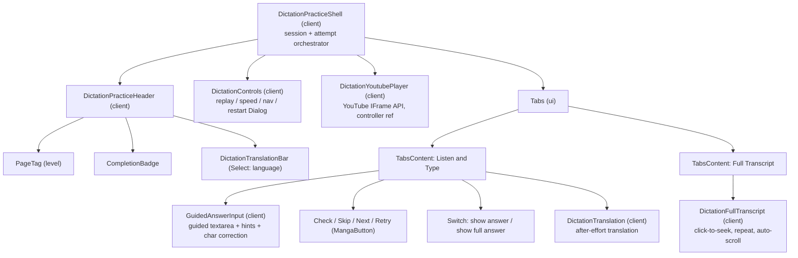
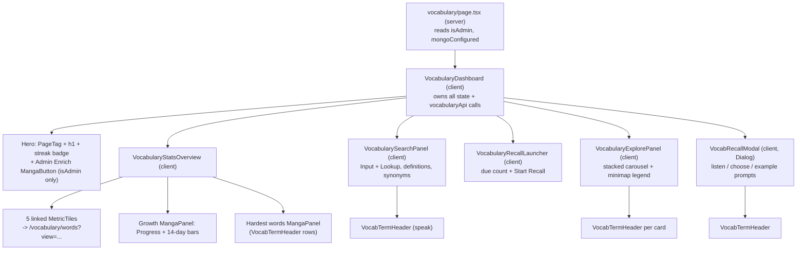

# 06 - Frontend

"English For Only Me" is a private, single-user IELTS study app built on Next.js 16
(App Router), React 19, and Tailwind CSS v4. Its frontend is organized around a
distinctive "manga / comic page" visual theme: every screen is a bordered paper
page with hard ink drop-shadows, halftone dot textures, and comic-style "page tag"
labels. The theme has two moods - a day "light" mode and an evening "light-up"
mode (manga paper under a reading lamp) toggled by a hanging pull-string bulb. This
document maps the design system, the light/light-up theming engine, the shared UI
primitive library, the full route tree, and the component trees for the home
"Study Desk", the dictation feature (browse, practice, results, review, stats,
admin), and the vocabulary feature (dashboard, word lists, recall, admin
enrichment). All claims are grounded in the source files cited by their
repo-relative paths. Two feature modules are shipped: Dictation and Vocabulary; the
remaining modules (Writing, AI Coach, Reading, Speaking) exist only as launcher
cards pointing at not-yet-built routes.

---

## 1. Design system and visual theme

### 1.1 The "manga page" aesthetic

The look is defined by a small set of recurring primitives, all styled with thick
black borders (`border-3 border-manga-black`), offset hard box-shadows (no blur),
uppercase black-weight display type, and warm paper tones.

| Primitive        | File                                       | Role                                                                                                                                                                                                                                                      |
| ---------------- | ------------------------------------------ | --------------------------------------------------------------------------------------------------------------------------------------------------------------------------------------------------------------------------------------------------------- |
| `MangaPageShell` | `src/components/common/MangaPageShell.tsx` | The outer "page". A centered, max-1460px bordered sheet with a halftone/ink gradient overlay (`::before`), a dashed inset frame (`::after`), and slots for `topbar`, `children` (main), and `footer`. Server component.                                   |
| `MangaPanel`     | `src/components/common/MangaPanel.tsx`     | A bordered white "panel" card built on the `Card` primitive. Optional `eyebrow` (rendered as a `PageTag`), `title` (uppercase h2), and `action` slot. Server component.                                                                                   |
| `MangaButton`    | `src/components/ui/MangaButton.tsx`        | The standard action button. Renders either a `Link` (when `href` is passed) or the base `Button`. Three tones: `primary` (paper-soft), `paper` (white), `ink` (black). Optional leading `icon` slot. Active state nudges the element down-right and drops its shadow. Server component. |
| `PageHero`       | `src/components/common/PageHero.tsx`       | Wrapper for a route hero block (eyebrow/tag/h1/description) that sits on the shell paper rather than in a card. Adds the `.page-hero` class so light-up mode lifts it into a lit card (see 1.5). Server component.                                          |
| `PageTag`        | `src/components/ui/PageTag.tsx`            | The small comic "page label" chip (e.g. "Home 00", "Page 01", "Listening"). Tone-driven background via `PAGE_TAG_TONES`. Server component.                                                                                                                |
| `IconButton`     | `src/components/ui/IconButton.tsx`         | Square 11x11 icon-only button/link, same manga border + shadow + active-nudge treatment. Server component.                                                                                                                                                |
| `ModuleCard`     | `src/components/ui/ModuleCard.tsx`         | Large module tile used by the home launcher: page tag, icon chip, title, description, skill label, CTA. Server component.                                                                                                                                 |
| `SketchChart`    | `src/components/common/SketchChart.tsx`    | Hand-drawn-style SVG line chart (red polyline over a dashed ink baseline). Server component.                                                                                                                                                              |
| `MetricTile`     | `src/components/common/MetricTile.tsx`     | Bordered stat tile (label, big value, detail, optional red trend line, icon). Tones red/paper/ink. Server component.                                                                                                                                      |
| `QueueRow`       | `src/components/common/QueueRow.tsx`       | A bordered list row (title + meta + status tag + action slot). Can be static, a link, or a clickable/keyboard-activatable button. Server component.                                                                                                       |

The halftone/ink texture is applied globally in `src/app/globals.css`: `html` paints a
radial dot grid plus a paper-to-white gradient; `body` layers diagonal ink/red
streaks and corner radial glows. `MangaPageShell` repeats a similar streak/glow
overlay inside the page frame via a `before:` pseudo-element and adds a dashed
inset border via `after:`.

### 1.2 Color tokens and CSS variables

`src/app/globals.css` defines raw manga colors on `:root`, maps them onto the
shadcn semantic tokens, then re-exports everything as Tailwind theme colors inside
`@theme inline` (Tailwind v4 style, no `tailwind.config`).

Raw palette (`:root`), mirrored as TypeScript in `src/constants/theme.ts`
(`THEME_COLORS`):

| Variable             | Value              | Constant key  |
| -------------------- | ------------------ | ------------- |
| `--manga-white`      | `#ffffff`          | `white`       |
| `--manga-black`      | `#050505`          | `black`       |
| `--manga-logo-red`   | `#e03020`          | `logoRed`     |
| `--manga-bright-red` | `#f03020`          | `brightRed`   |
| `--manga-pale-red`   | `#fff0ef`          | `paleRed`     |
| `--manga-paper`      | `#fff8f6`          | `paper`       |
| `--manga-paper-soft` | `#ffe7e4`          | `paperSoft`   |
| `--manga-ink-soft`   | `#343434`          | `inkSoft`     |
| `--manga-shadow`     | `rgba(5,5,5,0.18)` | (shadow only) |

Semantic mappings (`:root`): `--background` = paper, `--foreground`/`--secondary` =
black, `--primary`/`--destructive` = logo red, `--muted` = pale red, `--accent` =
paper-soft, `--ring`/`--dark-primary` = bright red, chart colors `--chart-1..5`
draw from the same palette, and `--radius` is `0.5rem` (with sm/md/lg/xl
derivations). `@theme inline` exposes these as utilities such as `bg-manga-white`,
`text-manga-black`, `text-manga-ink-soft`, `bg-manga-paper-soft`, `text-manga-red`
(mapped from logo red), plus font tokens and custom spacing (`--spacing-21` = 21px,
used by the topbar min-height).

`src/constants/theme.ts` also centralizes reusable class strings:
`MANGA_BORDER` (`thin`/`thick`), `MANGA_SHADOW` (`sm`/`md`/`lg`), and
`PAGE_TAG_TONES` (default, red, ink, pale, plus achievement tones sky, yellow,
copper, silver, gold, diamond used by completion badges).

### 1.3 Fonts

Fonts are wired in `src/app/layout.tsx`. Rather than `next/font`, the root `<html>`
sets CSS variables inline: `--font-montserrat` (Montserrat, the display/`font-sans`
face used for uppercase black headings) and `--font-source-sans` (Source Sans 3,
the body face). `globals.css` binds `--font-sans` to Montserrat and `--font-body`
to Source Sans 3 inside `@theme inline`, and sets `body { font-family: var(--font-source-sans) }`.
The document `<title>` template is `%s | English For Only Me`, theme color is the
logo red `#e03020`, and favicons/manifest are declared in the same file.

### 1.4 `cn()`, tailwind-merge, and class-variance-authority

`src/lib/utils.ts` exports `cn(...inputs)` = `twMerge(clsx(inputs))`. Every manga
component uses `cn()` to merge a base class string with a caller-supplied
`className`, letting `tailwind-merge` resolve conflicting Tailwind utilities so
overrides win. `class-variance-authority` (`cva`) is used inside the base shadcn
primitives (`button.tsx` `buttonVariants`, `badge.tsx`, `tabs.tsx`) to define
variant/size class maps; `MangaButton` and `IconButton` layer their manga styling
on top of `buttonVariants({ variant, size })`.

### 1.5 Light and light-up theming

The app has two themes, both manga - not a generic dark mode: a day `light`
(ink-on-white-paper) and an evening `lightup` ("trang giay duoi den doc sach", the
paper under a reading lamp). In light-up the shell/body paper goes dark (a warm
room) while cards stay light (lamp-lit paper); ink and borders stay dark because
they now sit on light cards. It auto-switches on the clock and can be toggled by
hand.

| Piece | File | Role |
| ----- | ---- | ---- |
| Pure theme logic | `src/lib/theme/theme.ts` | Dependency-free helpers: `autoThemeForTime`, `nextThreshold`, `resolveTheme`, `manualState`, `parseStoredTheme`. Window boundaries `MORNING_THRESHOLD_MIN` (06:30) and `EVENING_THRESHOLD_MIN` (18:30); a manual override wins only until the next threshold, then auto resumes. State is persisted under `THEME_STORAGE_KEY` (`efom-theme`). |
| `ThemeProvider` | `src/components/common/ThemeProvider.tsx` | Client. Reads the theme via `useSyncExternalStore` (external store over localStorage + wall clock; `getServerSnapshot` pins `light` to avoid hydration mismatch). Re-checks on a timer and on `visibilitychange`/`focus`, and syncs `data-theme` onto `<html>`. Exposes `useTheme()` -> `{ theme, toggle }`, with a safe default so it also works inside client `error.tsx` boundaries. |
| `PullStringToggle` | `src/components/common/PullStringToggle.tsx` | Client. A hanging pull-string bulb fixed to the top-right of the viewport (outside the page chrome). Yanks and swings on click, glows amber in light-up, dim in day; flips the theme via `useTheme().toggle`. Motion respects reduced-motion. |
| No-FOUC script | `src/app/layout.tsx` | An inline `<script>` (`THEME_INIT_SCRIPT`) that mirrors `theme.ts` and stamps `data-theme` on `<html>` before first paint. `<html suppressHydrationWarning>` covers the difference. The root layout wraps `children` in `ThemeProvider` and renders `PullStringToggle` once, globally. |

`src/app/globals.css` drives the whole flip off the `[data-theme]` attribute (not
`prefers-color-scheme`): `@custom-variant dark (&:where(.dark, .dark *))` rebinds
Tailwind's `dark:` variant to an explicit `.dark` class the app never adds, so
shadcn primitives' built-in `dark:` styles stop firing. The day defaults live on
`:root` as swappable vars (`--html-bg`, `--body-bg`, `--selection-bg`,
`--manga-offset` for shadow color, `--manga-line` for border ink), and
`:root[data-theme='lightup']` remaps the base `--manga-*` tokens plus those vars;
every `bg-manga-*` / `border-manga-*` / offset-shadow utility inherits the flip
automatically. Two light-up safety nets: `.page-hero` becomes a lit bordered card
(so dark hero text stays readable on the dark room), and scoped rules retint the
common `shadow-[Npx_Npx_0_var(--manga-black)]` offsets to the warm `--manga-offset`
ledge. The `.lamp-hang*` classes and `lamp-sway`/`lamp-yank`/`lamp-flash`
keyframes style the pull-string bulb.

---

## 2. The `ui/` primitive library

`components.json` declares a shadcn setup with `style: "base-nova"`, `rsc: true`,
base color neutral, CSS variables, and the lucide icon library. The primitives are
the shadcn "Base UI" variant: they wrap `@base-ui/react/*` components (not Radix).
`src/components/ui/` holds both these generated base primitives and the app's own
custom manga components.

| Component       | File                   | Kind           | `use client`? | Purpose                                                                                                          |
| --------------- | ---------------------- | -------------- | ------------- | ---------------------------------------------------------------------------------------------------------------- |
| `button`        | `ui/button.tsx`        | shadcn/base-ui | server        | Base `Button` on `@base-ui/react/button` with `buttonVariants` (cva). Foundation for `MangaButton`/`IconButton`. |
| `badge`         | `ui/badge.tsx`         | shadcn/base-ui | server        | Label badge (cva variants), uses `useRender`/`mergeProps`.                                                       |
| `card`          | `ui/card.tsx`          | shadcn/base-ui | server        | `Card`/`CardHeader`/`CardContent`/`CardFooter`. Base for `MangaPanel`, `ModuleCard`.                             |
| `input`         | `ui/input.tsx`         | shadcn/base-ui | server        | Text input on `@base-ui/react/input`.                                                                            |
| `textarea`      | `ui/textarea.tsx`      | shadcn/base-ui | server        | Multiline input.                                                                                                 |
| `label`         | `ui/label.tsx`         | shadcn/base-ui | client        | Form label.                                                                                                      |
| `checkbox`      | `ui/checkbox.tsx`      | shadcn/base-ui | client        | Checkbox on `@base-ui/react/checkbox`.                                                                           |
| `select`        | `ui/select.tsx`        | shadcn/base-ui | client        | Select menu family (`SelectTrigger`/`Content`/`Item`/`Value`).                                                   |
| `switch`        | `ui/switch.tsx`        | shadcn/base-ui | client        | Toggle switch.                                                                                                   |
| `slider`        | `ui/slider.tsx`        | shadcn/base-ui | server        | Range slider.                                                                                                    |
| `progress`      | `ui/progress.tsx`      | shadcn/base-ui | client        | Progress bar.                                                                                                    |
| `separator`     | `ui/separator.tsx`     | shadcn/base-ui | client        | Divider.                                                                                                         |
| `tabs`          | `ui/tabs.tsx`          | shadcn/base-ui | client        | Tabs family (cva), drives scene tabs and the practice Listen/Transcript tabs.                                    |
| `dialog`        | `ui/dialog.tsx`        | shadcn/base-ui | client        | Modal dialog family (on `@base-ui/react/dialog`).                                                                |
| `sheet`         | `ui/sheet.tsx`         | shadcn/base-ui | client        | Slide-out panel (also on the dialog primitive).                                                                  |
| `dropdown-menu` | `ui/dropdown-menu.tsx` | shadcn/base-ui | client        | Menu family (on `@base-ui/react/menu`), used by `UserMenu`.                                                      |
| `tooltip`       | `ui/tooltip.tsx`       | shadcn/base-ui | client        | Tooltip.                                                                                                         |
| `skeleton`      | `ui/skeleton.tsx`      | shadcn/base-ui | server        | Pulsing placeholder block, used in `loading.tsx`.                                                                |
| `MangaButton`   | `ui/MangaButton.tsx`   | custom app     | server        | Manga action button/link (section 1.1).                                                                          |
| `IconButton`    | `ui/IconButton.tsx`    | custom app     | server        | Manga icon-only button/link.                                                                                     |
| `PageTag`       | `ui/PageTag.tsx`       | custom app     | server        | Comic page-label chip.                                                                                           |
| `ModuleCard`    | `ui/ModuleCard.tsx`    | custom app     | server        | Home module launcher tile.                                                                                       |

---

## 3. Route map

All pages set `runtime = 'nodejs'`, and most set `dynamic = 'force-dynamic'` because
data is per-user and read at request time. Nearly every page guards on
`hasMongoDbUri()` (from `src/constants/environments.ts`) and renders a graceful
"MongoDB is not configured" state when the database is absent, so the app renders
without a backend. Auth uses `getOptionalUser()` /
`getPracticeActorId()` from `src/modules/dictation/services/getCurrentUser`.

| URL                                    | Group   | File                                           | Type                   | Purpose                                                                                                                                                                                                        | Auth                                           |
| -------------------------------------- | ------- | ---------------------------------------------- | ---------------------- | -------------------------------------------------------------------------------------------------------------------------------------------------------------------------------------------------------------- | ---------------------------------------------- |
| `/`                                    | (root)  | `src/app/page.tsx`                             | Server                 | Home "Study Desk". Loads per-user global dictation stats when signed in; renders `HomeStudyDesk`.                                                                                                              | Open (stats only when signed in)               |
| `/sitemap.xml`                         | (root)  | `src/app/sitemap.ts`                           | Server                 | Dynamic sitemap: static entries plus one per topic slug.                                                                                                                                                       | n/a                                            |
| `/dictation`                           | (app)   | `src/app/(app)/dictation/page.tsx`             | Server                 | Browse: topic grid + uncategorized bucket. Renders `TopicGrid`.                                                                                                                                                | Open                                           |
| `/dictation/[topicSlug]`               | (app)   | `src/app/(app)/dictation/[topicSlug]/page.tsx` | Server                 | Topic detail: sections accordion, or a flat filtered/paginated result set when a browse query is active. Has `generateMetadata` (canonical + OpenGraph). `notFound()` when topic missing.                      | Open (favorites need login)                    |
| `/dictation/favorites`                 | (app)   | `src/app/(app)/dictation/favorites/page.tsx`   | Server                 | The signed-in user's favorited lessons.                                                                                                                                                                        | Redirect to sign-in if anonymous               |
| `/dictation/no-topic`                  | (app)   | `src/app/(app)/dictation/no-topic/page.tsx`    | Server                 | Uncategorized lessons (no topic assigned).                                                                                                                                                                     | Open                                           |
| `/dictation/videos/[videoId]/practice` | (app)   | `.../videos/[videoId]/practice/page.tsx`       | Server                 | Loads video, transcript, segments, active session, translation tracks; renders `DictationPracticeShell`. Validates the 24-hex id, `notFound()` otherwise; shows setup states when transcript/segments missing. | Open (guest cookie or user via practice actor) |
| `/dictation/videos/[videoId]/results`  | (app)   | `.../videos/[videoId]/results/page.tsx`        | Server                 | Per-video results: summary, stats panel, AI debrief, weak-segment review queue. Empty state until real practice exists.                                                                                        | Open (practice actor)                          |
| `/dictation/review`                    | (app)   | `src/app/(app)/dictation/review/page.tsx`      | Server                 | Due weak-sentence review queue (limit 30). Renders `DictationReviewQueue`.                                                                                                                                     | Open (practice actor)                          |
| `/dictation/stats`                     | (app)   | `src/app/(app)/dictation/stats/page.tsx`       | Server                 | Whole-module stats dashboard (`DictationGlobalStats`). Zeros out for visitors with no history.                                                                                                                 | Open                                           |
| `/vocabulary`                          | (app)   | `src/app/(app)/vocabulary/page.tsx`            | Server + client island | Vocabulary dashboard: stats, growth, due flashcards, dictionary lookup, search results, and Explore.                                                                                                           | Open (practice actor)                          |
| `/vocabulary/words`                    | (app)   | `src/app/(app)/vocabulary/words/page.tsx`      | Server                 | Filtered vocabulary word list for `learning`, `dueToday`, `alreadyKnow`, `mastered`, and `knownTotal` views.                                                                                                   | Open (practice actor)                          |
| `/admin`                               | (admin) | `src/app/admin/page.tsx`                       | Server                 | Admin dashboard: link cards + topic/uncategorized counts.                                                                                                                                                      | Admin only (via layout)                        |
| `/admin/topics`                        | (admin) | `src/app/admin/topics/page.tsx`                | Server                 | Manage topics/sections/videos: create form, unassigned pool, drag-reorderable topic list.                                                                                                                      | Admin only                                     |
| `/admin/videos`                        | (admin) | `src/app/admin/videos/page.tsx`                | Server                 | Bulk video assignment table (topic/section/level, reorder, delete).                                                                                                                                            | Admin only                                     |
| `/admin/videos/[videoId]/edit`         | (admin) | `.../videos/[videoId]/edit/page.tsx`           | Server                 | Attach transcript source to a saved video (`DictationImportForm` in edit mode). Own admin guard + id validation.                                                                                               | Admin only (own redirect guard)                |
| `/admin/import`                        | (admin) | `src/app/admin/import/page.tsx`                | Server                 | Import a new YouTube video and attach transcript. Own admin guard.                                                                                                                                             | Admin only (own redirect guard)                |
| `/admin/vocab`                         | (admin) | `src/app/admin/vocab/page.tsx`                 | Server + client island | Vocabulary enrichment queue summary and Enrich N control.                                                                                                                                                      | Admin only                                     |

Route groups: `(app)` groups the learner-facing dictation routes; `(admin)` is not
a Next route group folder but a real `/admin` path segment whose `layout.tsx`
enforces the admin guard for all children. There is no `(app)` layout file; the
dictation routes each render their own `MangaPageShell` + `AppTopbar`.

Segment-level UX files (under `src/app/(app)/dictation/`):

- `loading.tsx` - Server. Suspense fallback for the dictation segment; renders a
  `MangaPageShell` + `MangaPanel` with two `Skeleton` blocks.
- `error.tsx` - Client (`'use client'`). Error boundary; logs the error and renders
  a `MangaPanel` with a `MangaButton` calling `unstable_retry()`.

The `/admin/layout.tsx` guard redirects anonymous users to
`/api/auth/signin?callbackUrl=/admin` and non-admins to `/dictation`. The
`/admin/import` and `/admin/videos/[videoId]/edit` pages repeat the same guard
inline (defense in depth, plus id-format validation).

---

## 4. The home "Study Desk"

`src/app/page.tsx` (server) reads optional per-user stats for both shipped
modules in parallel - `getGlobalStatsForUser` (dictation) and
`getVocabStatsForUser` (vocabulary) - and passes them to `HomeStudyDesk` (server,
`src/components/home/HomeStudyDesk.tsx`) as `dictationStats` + `vocabStats`.
Anonymous visitors (or a missing DB) render the desk with no personal stats. The
desk is a two-column `MangaPageShell`:

- Left "page" (`<section>`): hero title, a hand-drawn `StudyDeskSketch` (inline
  SVG of a desk), the `HomeTodayPanel`, and the `HomeModuleLauncher`.
- Right "IELTS path" aside: `HomeIeltsSnapshot` (dictation stat tiles + focus
  panel), `HomeVocabularySnapshot` (vocabulary stat cards - recall due, known
  total, streak, accuracy), and `HomeFutureModuleMap`. `HomeVocabularySnapshot`
  is an inline component inside `HomeStudyDesk.tsx`, not a separate file.

Sub-panels (all server components):

| Panel                 | File                           | What it shows                                                                                                                                                                         |
| --------------------- | ------------------------------ | ------------------------------------------------------------------------------------------------------------------------------------------------------------------------------------- |
| `HomeTodayPanel`      | `home/HomeTodayPanel.tsx`      | "Today" tasks derived from stats: weekly practice minutes, weak-word count, due review count; plus an "Open Dictation Lab" `MangaButton` and a disabled "Add Module Later" button.    |
| `HomeModuleLauncher`  | `home/HomeModuleLauncher.tsx`  | Grid of the first four `APP_MODULES` as `ModuleCard`s, each with a lucide icon (mapped by module key). Only `active` modules get a live `href` and "Open" CTA; others show "Planned". |
| `HomeIeltsSnapshot`   | `home/HomeIeltsSnapshot.tsx`   | Four `MetricTile`s (listening streak, videos completed, weak words, next review) from `dictationStats`, plus a "This week / Focus" `MangaPanel` whose copy switches on whether reviews are due. |
| `HomeVocabularySnapshot` | `home/HomeStudyDesk.tsx` (inline) | Four vocabulary stat cards (recall due, known total, day streak, recall accuracy) from `vocabStats`. Defined inside `HomeStudyDesk`, rendered in the right aside. |
| `HomeFutureModuleMap` | `home/HomeFutureModuleMap.tsx` | Four `QueueRow`s (Listening active, Reading/Writing/Speaking "Later") with icon action chips - a static roadmap, not stats-driven.                                                    |

`APP_MODULES` (`src/constants/modules.ts`) is the single source of truth for the
module system: each entry has `key`, `title`/`shortTitle`, `href`, `pageTag`,
`skill`, `status` (`active` | `future` | `secondary`), and `description`. Only
`dictation` and `vocabulary` are `active` (`href: /dictation` and
`/vocabulary`). `PRIMARY_NAV_ITEMS` is derived from `APP_MODULES` (prepending a
"Study Desk" -> `/` item) and is the default nav used by `AppTopbar`.

---

## 5. The dictation feature UI

### 5.1 Two entry-point families

There are two parallel implementations of the dictation UI:

1. Live, data-backed pages under `src/app/(app)/dictation/**` (browse, practice,
   results, review, stats). These render the real components described below.
2. A static demo/mockup family - `DictationHome` (server) -> `DictationSceneTabs`
   (client `Tabs`) -> `DictationLibraryScene`, `DictationPracticeScene`,
   `DictationStatsScene`, `DictationReviewScene`. These are prototype scenes driven
   by constants in `src/constants/dictation.ts` (`DICTATION_SCENES`,
   `DICTATION_RECENT_VIDEOS`, etc.) and local state, with no network calls. They
   are not wired into the shipped routes but exist as the design reference for the
   four scenes. `DictationRecentVideosGrid` (client) is the paginated recent-videos
   grid used by the library scene.

The remainder of this section documents the live flow.

### 5.2 Browse flow

`/dictation` (server) -> `TopicGrid` (server, `browse/TopicGrid.tsx`): grid of topic
cards (thumbnail via a safe-URL guard, level range, lesson count) plus a muted
"Uncategorized" card when topic-less videos exist. Links to
`/dictation/[topicSlug]` and `/dictation/no-topic`.

`/dictation/[topicSlug]` (server) decides between two views based on
`isBrowseQueryActive`:

- No active query -> `TopicAccordion` -> `SectionAccordion` (client,
  `browse/SectionAccordion.tsx`): collapsible per-section panels (`useState` open
  toggle) listing `VideoCard`s. Each card renders `DictationVideoThumbnail`,
  `CompletionBadge`, and `FavoriteButton`, and links to the video's `practiceHref`.
- Active query (search/level/sort) -> `FlatResults` -> `BrowseVideoList` (exported
  from `SectionAccordion.tsx`) + `BrowsePagination`.

Supporting browse components:

| Component                 | File                                    | Client? | Role                                                                                                                                                                                     |
| ------------------------- | --------------------------------------- | ------- | ---------------------------------------------------------------------------------------------------------------------------------------------------------------------------------------- |
| `BrowseToolbar`           | `browse/BrowseToolbar.tsx`              | client  | Search input + level/sort `Select`s. Debounces search 300ms; writes query string via `useRouter().replace`, resetting `page`. Uses `next/navigation`, no `src/requests`.                 |
| `BrowsePagination`        | `browse/BrowsePagination.tsx`           | server  | Link-based prev/next preserving query; hidden on a single page.                                                                                                                          |
| `BrowseBreadcrumb`        | `browse/BrowseBreadcrumb.tsx`           | server  | "All topics / current" breadcrumb.                                                                                                                                                       |
| `FavoriteButton`          | `browse/FavoriteButton.tsx`             | client  | Optimistic star toggle. Calls the `toggleFavoriteAction` server action (`modules/dictation/content/favoriteActions`), `useTransition` for pending, redirects anonymous users to sign-in. |
| `DictationVideoThumbnail` | `dictation/DictationVideoThumbnail.tsx` | server  | Safe YouTube thumbnail (`next/image`, host allow-list) with a "No thumbnail" fallback.                                                                                                   |
| `CompletionBadge`         | `dictation/CompletionBadge.tsx`         | server  | Tiered medal `PageTag` from completion count; renders nothing below the lowest tier.                                                                                                     |

`/dictation/favorites` and `/dictation/no-topic` reuse `BrowseVideoList` +
`BrowseBreadcrumb`.

### 5.3 Practice flow

The practice page loads segments/session/translation tracks server-side and hands
them to `DictationPracticeShell` (client,
`src/components/dictation/DictationPracticeShell.tsx`), the stateful orchestrator.
It scores answers locally first (via `modules/dictation/correction` helpers) and
serializes server persistence through a promise-queue ref. It calls two request
helpers: `startOrResumeDictationSessionApi` + `updateDictationSessionApi`
(`src/requests/dictationSessionsApi.ts`) and `submitDictationAttemptApi`
(`src/requests/dictationAttemptsApi.ts`). It uses preference and shortcut hooks
(Enter = check, Esc = reveal/skip, Ctrl+[/] = move segments, Alt/Cmd = replay) and
persists answer drafts locally.

Important: `DictationPracticeScene` is NOT a child of the shell - it is the separate
static mockup from section 5.1. The live tree is:

Practice component reference:

| Component                      | File                               | Client? | Role / API                                                                                                                                                                                         |
| ------------------------------ | ---------------------------------- | ------- | -------------------------------------------------------------------------------------------------------------------------------------------------------------------------------------------------- |
| `DictationPracticeShell`       | `DictationPracticeShell.tsx`       | client  | Orchestrator. Calls `dictationSessionsApi`, `dictationAttemptsApi`.                                                                                                                                |
| `DictationPracticeHeader`      | `DictationPracticeHeader.tsx`      | client  | Eyebrow/title/level + `CompletionBadge` + `DictationTranslationBar`. Presentational.                                                                                                               |
| `DictationYoutubePlayer`       | `DictationYoutubePlayer.tsx`       | client  | Segment-aware YouTube IFrame wrapper; exposes a controller (replay/seek/playSegment) upward; supports `mockPlayer` for tests. No `src/requests`.                                                   |
| `DictationControls`            | `DictationControls.tsx`            | client  | Playback/nav toolbar; speed and text-size presets; restart confirm `Dialog`.                                                                                                                       |
| `GuidedAnswerInput`            | `GuidedAnswerInput.tsx`            | client  | Guided textarea with hint chips (Tab fills next hint) and character-level correction overlay. Uses `correction` module helpers. Exposes a `renderCorrectionWord` slot; the shell passes `QuickVocabWordButton` so corrected words become click-to-look-up vocabulary chips (see section 6). |
| `DictationAnswerBox`           | `DictationAnswerBox.tsx`           | client  | Simpler standalone answer box (Check/Reveal/Skip). Not used by the shell.                                                                                                                          |
| `DictationFeedback`            | `DictationFeedback.tsx`            | client  | Standalone attempt-result panel (token chips). Not rendered by the shell.                                                                                                                          |
| `DictationTranslation`         | `DictationTranslation.tsx`         | client  | After-effort translation caption; returns null until unlocked.                                                                                                                                     |
| `DictationTranslationBar`      | `DictationTranslationBar.tsx`      | client  | Translation-language `Select` (or "None").                                                                                                                                                         |
| `DictationFullTranscript`      | `DictationFullTranscript.tsx`      | client  | Interactive transcript tab: click-to-seek, repeat/auto-scroll toggles, per-segment status badges, auto-scroll to active.                                                                           |
| `DictationTranscriptDrawer`    | `DictationTranscriptDrawer.tsx`    | client  | Alternate `Sheet`-based transcript view. Not used by the shell.                                                                                                                                    |
| `DictationCaptionManager`      | `DictationCaptionManager.tsx`      | client  | Authoring panel: upload/paste captions, set primary + translation tracks, build segments, delete. Calls `dictationTranscriptsApi` (attach/attach-track/delete) and `dictationSegmentsApi` (build). |
| `DictationSegmentEditor`       | `DictationSegmentEditor.tsx`       | client  | Authoring: edit/split/merge segments in local state (segmenting module helpers); no network.                                                                                                       |
| `DictationBuildSegmentsButton` | `DictationBuildSegmentsButton.tsx` | client  | Triggers `buildDictationSegmentsApi` then `router.refresh()`. Used on practice setup states.                                                                                                       |

### 5.4 Results, review, and stats

`/dictation/videos/[videoId]/results` (server) composes, in order:
`DictationResultsSummary` (server) -> then, when non-empty, `DictationStatsPanel`
(server), `DictationDebriefPanel` (client), and `DictationReviewQueue` (server)
titled "Weak segments from this video". When empty it shows a "Practice first"
`MangaPanel`.

`/dictation/review` (server) renders an intro `MangaPanel` + `DictationReviewQueue`
(server) fed by `listDueReviewItemsForUser`. `/dictation/stats` (server) renders
`DictationGlobalStats` (server).

| Component                 | File                          | Client? | Role / API                                                                                                                                                          |
| ------------------------- | ----------------------------- | ------- | ------------------------------------------------------------------------------------------------------------------------------------------------------------------- |
| `DictationResultsSummary` | `DictationResultsSummary.tsx` | server  | Per-video results header (thumbnail, title, status, empty/non-empty framing).                                                                                       |
| `DictationStatsPanel`     | `DictationStatsPanel.tsx`     | server  | Per-video stat tiles (`MetricTile` and friends).                                                                                                                    |
| `DictationDebriefPanel`   | `DictationDebriefPanel.tsx`   | client  | AI debrief: shows the latest debrief and can generate a new one via `dictationDebriefsApi` (`createDictationDebriefApi`); `canGenerate` gated on a completed video. |
| `DictationReviewQueue`    | `DictationReviewQueue.tsx`    | server  | Renders due weak-sentence review items (`QueueRow`-style rows) with an empty-state message.                                                                         |
| `DictationGlobalStats`    | `DictationGlobalStats.tsx`    | server  | Whole-module dashboard (metric tiles + `SketchChart` progress).                                                                                                     |
| `DictationStatsScene`     | `DictationStatsScene.tsx`     | server  | Static demo stats scene (constants).                                                                                                                                |
| `DictationReviewScene`    | `DictationReviewScene.tsx`    | server  | Static demo review scene (constants).                                                                                                                               |

The results/stats server components take plain record props (stats objects, review
items, debrief record) computed on the page; the only client component here,
`DictationDebriefPanel`, is the one that calls a request helper directly (debrief
generation is client-triggered so it can stream/poll a longer AI job).

### 5.5 Admin

Admin pages are server components that load content via the content repository and
hand it to client components. All admin mutations go through server actions in
`src/modules/dictation/content/adminActions` (not `src/requests/*`); the one
exception is `DictationImportForm`, which calls the client request helper
`importYouTubeVideoApi` (`src/requests/dictationImportsApi.ts`).

| Component                   | File                                  | Client? | Role / actions                                                                                                                                                                                                                                  |
| --------------------------- | ------------------------------------- | ------- | ----------------------------------------------------------------------------------------------------------------------------------------------------------------------------------------------------------------------------------------------- |
| `AdminTopicList`            | `admin/AdminTopicList.tsx`            | client  | Ordered topic list with drag-reorder (`reorderTopicsAction`), `router.refresh()`.                                                                                                                                                               |
| `AdminTopicCard`            | `admin/AdminTopicCard.tsx`            | client  | Expandable topic editor: sections, ungrouped videos, moves, reorders. Many actions (create/delete/update section, move/remove/reorder video, update/delete topic). Renders `AdminVideoRow`, `AdminTopicThumbnailFields`, `ConfirmSubmitButton`. |
| `AdminCreateTopicForm`      | `admin/AdminCreateTopicForm.tsx`      | client  | Create-topic form (`createTopicAction`, multipart).                                                                                                                                                                                             |
| `AdminTopicThumbnailFields` | `admin/AdminTopicThumbnailFields.tsx` | client  | Thumbnail file upload (`uploadTopicThumbnailAction`) feeding a hidden field.                                                                                                                                                                    |
| `AdminUnassignedPanel`      | `admin/AdminUnassignedPanel.tsx`      | client  | Collapsible pool of topic-less videos; both drag source and unassign drop target (`moveVideoAction`).                                                                                                                                           |
| `AdminVideoRow`             | `admin/AdminVideoRow.tsx`             | client  | Shared draggable/selectable video row (grip, thumbnail, level `Select` via `updateVideoLevelAction`, edit link).                                                                                                                                |
| `VideoAssignTable`          | `admin/VideoAssignTable.tsx`          | client  | `/admin/videos` bulk table: filter/search, multi-select, bulk assign (`assignVideosAction`), reorder (`reorderVideosAction`), delete (`deleteVideoAction`).                                                                                     |
| `adminVideoDnd`             | `admin/adminVideoDnd.tsx`             | client  | Shared DnD primitives (`DropZone`, `ReorderHandle`), MIME constants, `reorderIds` re-export.                                                                                                                                                    |
| `ConfirmSubmitButton`       | `admin/ConfirmSubmitButton.tsx`       | client  | Confirm-modal submit button that calls `form.requestSubmit()` on confirm.                                                                                                                                                                       |
| `DictationImportForm`       | `dictation/DictationImportForm.tsx`   | client  | Import/edit form; saves a video via `importYouTubeVideoApi`, then reveals `DictationCaptionManager`. Modes `import` and `edit`.                                                                                                                 |

Drag-and-drop is built entirely on the native HTML5 Drag and Drop API (no external
library). `adminVideoDnd.tsx` centralizes `DropZone`/`ReorderHandle` and four
MIME-typed payloads that keep interactions isolated: `MIME_TOPIC` (reorder topics),
`MIME_SECTION` (reorder sections), `MIME_VIDEO` (move a video between
topics/sections/unassigned), and `MIME_VIDEO_SECTION` (carry the source section for
within-section reorder). Reorders apply optimistically, then persist via a server
action + `router.refresh()`. `VideoAssignTable` uses its own private
`VIDEO_ORDER_MIME` for row reordering.

---

## 6. Vocabulary feature UI

### 6.1 Vocabulary routes

| URL                | File                                     | Type                   | Purpose                                                                                         | Auth                    |
| ------------------ | ---------------------------------------- | ---------------------- | ----------------------------------------------------------------------------------------------- | ----------------------- |
| `/vocabulary`      | `src/app/(app)/vocabulary/page.tsx`      | Server + client island | Vocabulary dashboard: stats/growth, recall launcher + modal, dictionary lookup, search, Explore. | Open (practice actor)   |
| `/vocabulary/words`| `src/app/(app)/vocabulary/words/page.tsx`| Server                 | Filtered word list for `learning`, `dueToday`, `alreadyKnow`, `mastered`, `knownTotal` views.    | Open (practice actor)   |
| `/admin/vocab`     | `src/app/admin/vocab/page.tsx`           | Server + client island | Enrichment queue summary + `Enrich N` batch control.                                             | Admin only (via layout) |

All three pages set `dynamic = 'force-dynamic'` and `runtime = 'nodejs'` and render
the manga shell + `AppTopbar`. Server-only data on `/vocabulary` is loaded from the
client through `src/requests/vocabularyApi.ts` (so the client island never imports
server modules); `/vocabulary/words` and `/admin/vocab` fetch their initial data on
the server. The `getPracticeActorId()` actor (user id, else guest cookie) scopes
per-user data.

### 6.2 `/vocabulary` dashboard tree

`/vocabulary` (`src/app/(app)/vocabulary/page.tsx`) reads `auth()` only for the
`isAdmin` flag and passes it plus `mongoConfigured` into the client island
`VocabularyDashboard` (`src/components/vocabulary/VocabularyDashboard.tsx`). The
dashboard owns all vocabulary state (stats, search results, selected entry, explore
entries + optimistic decisions, recall tasks, modal open) and calls the request
helpers in `vocabularyApi.ts`: `getVocabStatsApi`, `getExploreVocabApi`,
`getDueVocabRecallApi`, `searchVocabApi`, `lookupVocabEntryApi`,
`setVocabItemStatusApi`, `answerVocabRecallApi`. When `mongoConfigured` is false it
renders a "Database needed" `MangaPanel`.

Area behavior:

- Stats and growth (`VocabularyStatsOverview`): five linked `MetricTile` counters
  (Learning, Due Today, Already Know, Mastered, Known Total) navigating to
  `/vocabulary/words?view=...`, a `Progress` bar plus a 14-day bar chart of daily
  growth, and a "Hardest words" panel of `VocabTermHeader` rows.
- Recall (`VocabularyRecallLauncher` + `VocabRecallModal`): the launcher is an
  ink-toned `MangaPanel` showing the due count and up to four upcoming cards with a
  "Start Recall" button; the modal is a full-screen `Dialog` that runs the flashcard
  task types (`listenChooseWord`, `listenChooseDefinition`, `definitionChooseWord`,
  `wordChooseDefinition`, `exampleRemember`) with speech synthesis, WebAudio
  correct/wrong tones, a "Correct answer" reveal on a miss, and a "I cannot listen
  now" skip for listening tasks. The dashboard auto-opens it once per day when cards
  are due (localStorage-gated).
- Dictionary/search (`VocabularySearchPanel`): an `Input` + `Lookup` calling
  `lookupVocabEntryApi`, then `searchVocabApi` for related results; shows the
  required Vietnamese meaning, English definitions/examples, synonyms, enrichment
  status, and Should Learn / Already Know actions (disabled until a Vietnamese
  meaning exists). Speech is browser `speechSynthesis`.
- Explore (`VocabularyExplorePanel`): unclassified, already-enriched
  frequency-ranked words as a stacked carousel with prev/next controls and no
  horizontal scrollbar; neighbor cards are clickable layers that move into focus,
  and the minimap below jumps to any card. The legend swatches are white
  (unpicked), pink (`Should Learn`), green (`Already Know`), plus an outlined active
  square. Should Learn / Already Know decisions are applied optimistically (see
  `markEntry` with the `explore` source) and rolled back on error.

### 6.3 `/vocabulary/words` list

`/vocabulary/words` parses its `view` search param with
`parseVocabWordListView` (`src/modules/vocabulary/services/vocabWordListService.ts`),
reads the current practice actor via `getPracticeActorId()`, loads the words with
`listVocabWordsForUser`, and renders the client `VocabularyWordList`
(`src/components/vocabulary/VocabularyWordList.tsx`). The five view tabs are colored
`Link`s (one per view) with `aria-current` on the active tab. Pagination is
client-side over the server-fetched array, defaulting to 50 per page with presets
5/10/20/30/50/100/200 (a `Select`) plus a custom numeric `Input`. Each word card
(`VocabTermHeader`, status meta, frequency `PageTag`, Vietnamese + English preview)
can call `setVocabItemStatusApi` to flip the word to `Should Learn` or
`Already Know`, updating the client list immediately and dropping words that no
longer match the active view. There is no dedicated API route for this
server-rendered list.

### 6.4 `/admin/vocab` enrichment

`/admin/vocab` (`src/app/admin/vocab/page.tsx`, guarded by the `/admin` layout)
fetches the initial queue summary server-side (`getVocabAdminQueueSummary`) and
renders the client `AdminVocabPanel` (`src/components/vocabulary/AdminVocabPanel.tsx`).
It shows five `MetricTile` counters (Enrichable, Ready, Failed, Not Found, Stale
Locks), a refresh icon button (`getVocabAdminQueueApi`), and an `Enrich N` control
(`enrichVocabularyAdminApi`); the client caps the input at 10, and the server route
enforces max 10 and `requireAdmin()`. The `/vocabulary` "Admin Enrich" shortcut is
shown only when `isAdmin` is true.

### 6.5 Vocabulary UI primitives and dictation integration

Two vocabulary-only building blocks recur across the components:

| Component | File | Client? | Role |
| --------- | ---- | ------- | ---- |
| `VocabTermHeader` | `vocabulary/VocabTermHeader.tsx` | client | Shared term header: big term + phonetic pronunciation + a speak `Button` (uses an injected `speakTerm` or a `speechSynthesis` fallback). Size presets `md`/`lg`/`xl`. Used by the stats, search, explore, recall, and word-list surfaces. |
| `QuickVocabLookup` / `QuickVocabWordButton` | `vocabulary/QuickVocabLookup.tsx` | client | `QuickVocabWordButton` wraps a single word as a click-to-look-up trigger that opens a `Dialog` with the entry (Vietnamese meaning, definition, Should Learn / Already Know). `QuickVocabLookup` tokenizes a whole sentence into per-word buttons. Both call `lookupVocabEntryApi` (with occurrence context) and `setVocabItemStatusApi`. |

`QuickVocabWordButton` is wired into dictation: `DictationPracticeShell` passes it
to `GuidedAnswerInput`'s `renderCorrectionWord` slot, so corrected words in the
guided answer become click-to-look-up vocabulary chips carrying the current
`attemptId`, `segmentId`, `videoId`, and context sentence.

## 7. Shared layout chrome

Every page wraps its content in `MangaPageShell` and passes an `AppTopbar` into the
`topbar` slot (server pages also inject `<AuthControl />` into the topbar's
`authControl` slot).

- `AppTopbar` (`src/components/common/AppTopbar.tsx`, server): the page header -
  logo + title + subtitle (links to `/`), a horizontal primary nav rendered from
  `PRIMARY_NAV_ITEMS` (default) with `aria-current` on the active `activeHref`, and
  an `authControl` slot. It is intentionally client-safe: it takes the auth control
  as a `ReactNode` slot rather than importing the NextAuth/Mongoose chain, so the
  client `error.tsx` can render it without dragging server-only code into the
  browser bundle.
- `AuthControl` (`src/components/common/AuthControl.tsx`, server async): reads the
  session via `auth()`. Renders nothing if Google auth is unconfigured
  (`hasGoogleAuth()`), a "Sign in" `MangaButton` (server-action `signIn('google')`)
  when signed out, or `UserMenu` when signed in.
- `UserMenu` (`src/components/common/UserMenu.tsx`, client): the identity chip
  (avatar or initial) as a `DropdownMenu` trigger, with a Favorites link, an Admin
  link (admins only), and a destructive "Sign out" that opens a confirm `Dialog`.
  The `signOut` server action is injected as a prop so this client file never
  imports the auth chain.
- `ThemeProvider` + `PullStringToggle` are mounted once in `src/app/layout.tsx`
  (not in the topbar): the provider wraps every page and the pull-string bulb is
  fixed to the viewport corner across all routes (see section 1.5). The topbar
  itself renders no theme control.

Navigation source of truth: `PRIMARY_NAV_ITEMS` in `src/constants/modules.ts`
("Study Desk" plus every `APP_MODULES` short title). Only `dictation` and
`vocabulary` are `active`; the remaining nav items (Writing, Coach, Reading,
Speaking) are rendered `disabled` and point at routes that are not yet
implemented.

---

## 8. Loading and error states, skeletons

- Route-level Suspense: `src/app/(app)/dictation/loading.tsx` (server) renders the
  manga shell with a `MangaPanel` containing two `Skeleton` blocks (the only use of
  the `Skeleton` primitive in app routes).
- Route-level error boundary: `src/app/(app)/dictation/error.tsx` (client) logs the
  error in a `useEffect` and offers a `MangaButton` -> `unstable_retry()`.
- Config-absent states: nearly every server page renders a bordered "MongoDB is not
  configured" panel (with `MangaButton` links back to the lab / import / add
  transcript) instead of crashing when `hasMongoDbUri()` is false.
- Practice/results setup states: the practice and results pages render dedicated
  `PracticeSetupState` / `ResultsSetupState` panels for "transcript needed" and
  "segments not ready", wiring in `DictationBuildSegmentsButton` and links to the
  admin edit/import pages.
- In-component feedback: `FavoriteButton`, `DictationBuildSegmentsButton`,
  `DictationDebriefPanel`, admin forms, and the import form use `useTransition` /
  local `isSubmitting`/`isBuilding` state and disabled buttons for pending UI, plus
  inline error messages; `DictationPracticeShell` shows completed/not-started
  states inside the practice tab.

Empty states are handled per component: `BrowseVideoList` (no lessons),
`SectionAccordion` (no sections), `DictationReviewQueue` (no due items),
`AdminUnassignedPanel` (renders null when empty), and the results "Practice first"
panel.
